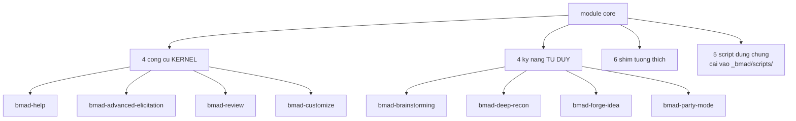
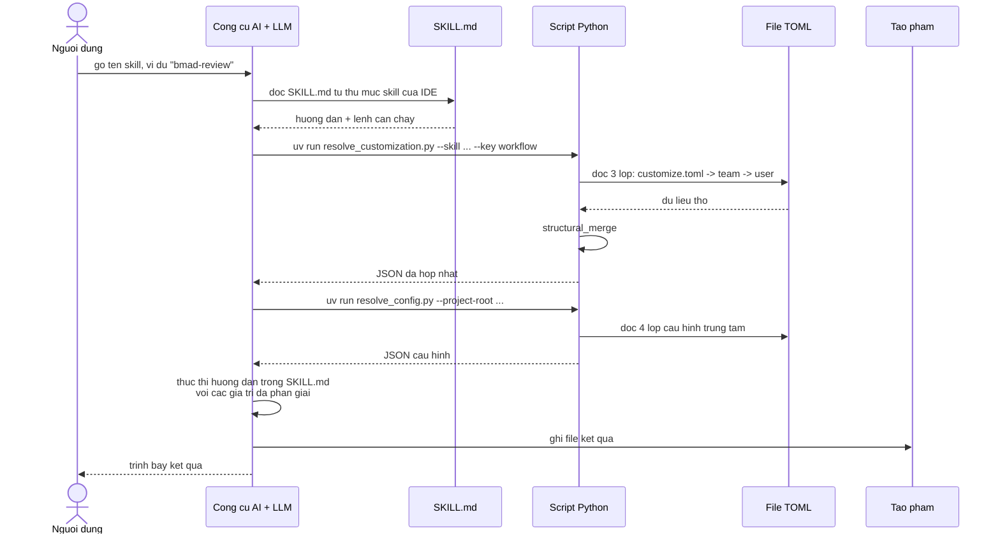

# Chỉ mục — Cách thức vận hành thư mục CORE

> Tài liệu chi tiết về **module `core`** của BMAD-METHOD v6.10.0 — dùng để đọc hiểu và **vận hành thủ công**.
>
> **Lưu ý về tên thư mục:** trong BMad v6 **không còn** thư mục `bmad_core` (đó là cấu trúc của v4/v5). Vị trí tương đương hiện nay:
>
> | Ngữ cảnh | Đường dẫn |
> | --- | --- |
> | Mã nguồn (repo này) | `src/core-skills/` |
> | Sau khi cài vào dự án | `_bmad/core/` |
> | Bản sao cho công cụ AI | `.claude/skills/bmad-*` hoặc `.agents/skills/bmad-*` |
> | Script dùng chung | `src/scripts/` → cài thành `_bmad/scripts/` |
>
> Tài liệu này mô tả cả ba vị trí đó.

---

## Bản đồ tài liệu

### Phần A — Cơ chế nền tảng (đọc trước)

| # | Tài liệu | Nội dung |
| --- | --- | --- |
| A1 | **[Tổng quan module core](./A1-tong-quan-module-core.md)** | Cấu trúc thư mục, `module.yaml`, `module-help.csv`, vòng đời từ nguồn đến bản cài |
| A2 | **[Giải phẫu một skill](./A2-giai-phau-mot-skill.md)** | `SKILL.md`, frontmatter, `customize.toml`, `references/`, `assets/`, `scripts/`, quy tắc đường dẫn |
| A3 | **[Hệ thống cấu hình và tùy biến](./A3-cau-hinh-va-tuy-bien.md)** | 4 lớp trung tâm, 3 lớp skill, thuật toán hợp nhất, cách tự tay override |
| A4 | **[Script dùng chung](./A4-script-dung-chung.md)** | `config_utils.py`, `resolve_config.py`, `resolve_customization.py`, `render_skill.py`, `memlog.py` — cú pháp và cách chạy tay |
| A5 | **[Giao thức kích hoạt chung](./A5-giao-thuc-kich-hoat.md)** | Trình tự mọi skill core đều theo; điều gì xảy ra khi script lỗi |

### Phần B — Từng skill trong core

| # | Skill | Tài liệu | Vai trò |
| --- | --- | --- | --- |
| B1 | `bmad-help` | **[bmad-help](./B1-bmad-help.md)** | La bàn — biết đang ở đâu, đi đâu tiếp |
| B2 | `bmad-advanced-elicitation` | **[bmad-advanced-elicitation](./B2-bmad-advanced-elicitation.md)** | Điểm dừng tinh chỉnh dùng chung |
| B3 | `bmad-review` | **[bmad-review](./B3-bmad-review.md)** | Review đa lăng kính, một hình dạng finding |
| B4 | `bmad-customize` | **[bmad-customize](./B4-bmad-customize.md)** | Trợ lý viết file override TOML |
| B5 | `bmad-brainstorming` | **[bmad-brainstorming](./B5-bmad-brainstorming.md)** | Phiên ý tưởng có điều phối, 3 lập trường |
| B6 | `bmad-deep-recon` | **[bmad-deep-recon](./B6-bmad-deep-recon.md)** | Nghiên cứu cấp quyết định, 3 dịch vụ |
| B7 | `bmad-forge-idea` | **[bmad-forge-idea](./B7-bmad-forge-idea.md)** | Rèn ý tưởng đến khi cứng, đúng, hoặc chết rẻ |
| B8 | `bmad-party-mode` | **[bmad-party-mode](./B8-bmad-party-mode.md)** | Bàn tròn đa nhân vật |
| B9 | v6-shims | **[v6-shims](./B9-v6-shims.md)** | 6 skill chuyển tiếp ID cũ |

### Phần C — Vận hành thủ công

| # | Tài liệu | Nội dung |
| --- | --- | --- |
| C1 | **[Sổ tay vận hành thủ công](./C1-so-tay-van-hanh-thu-cong.md)** | Chạy từng script bằng tay, đọc kết quả, sửa lỗi, tự mô phỏng một skill mà không cần LLM |

---

## Ba câu hỏi thường gặp nhất

### 1. "Core gồm những gì?"

> Tài liệu gốc gọi 4 công cụ đầu là *kernel tools* và 4 công cụ sau là *thinking skills*. Riêng `bmad-deep-recon` được xếp vào nhóm thinking skills dù bản chất là nghiên cứu.

### 2. "Luồng dữ liệu chạy như thế nào?"

### 3. "Tôi muốn tự chạy tay để hiểu — bắt đầu từ đâu?"

Đọc [A4 — Script dùng chung](./A4-script-dung-chung.md) rồi [C1 — Sổ tay vận hành thủ công](./C1-so-tay-van-hanh-thu-cong.md).

---

## Bảng tra cứu nhanh: skill → file → script

| Skill | File chính | Script riêng | Có `customize.toml`? | Tạo phẩm |
| --- | --- | --- | --- | --- |
| `bmad-help` | `SKILL.md` | không | ❌ | không (chỉ hướng dẫn) |
| `bmad-advanced-elicitation` | `SKILL.md` + `assets/methods.csv` | `pick_methods.py` | ✅ | không (sửa nội dung tại chỗ) |
| `bmad-review` | `SKILL.md` + 7 file `references/` | `word_metrics.py` | ✅ | findings JSON + báo cáo MD |
| `bmad-customize` | `SKILL.md` | `list_customizable_skills.py` | ❌ | file TOML trong `_bmad/custom/` |
| `bmad-brainstorming` | `SKILL.md` + 8 file `references/` | `brain.py` | ✅ | `brainstorm.html`, `.memlog.md` |
| `bmad-deep-recon` | `SKILL.md` + 9 `references/` + 6 `types/` | `recon_kit.py` | ✅ | `research.md`, briefing HTML |
| `bmad-forge-idea` | `SKILL.md` | `resolve_personas.py` | ✅ | `forge-report.html`, `forged-idea.md` |
| `bmad-party-mode` | `SKILL.md` + 5 file `references/` | `resolve_party.py` | ✅ | keepsake HTML, memlog theo party |

---

## Bảng tra cứu: cấu hình nào ảnh hưởng skill nào

| Khóa cấu hình | Lấy từ | Ảnh hưởng skill |
| --- | --- | --- |
| `core.user_name` | `config.user.toml` | Mọi skill (lời chào) |
| `core.communication_language` | `config.user.toml` | Mọi skill (ngôn ngữ hội thoại) |
| `core.document_output_language` | `config.toml` | Mọi skill sinh tài liệu |
| `core.project_name` | `config.toml` | brainstorming, deep-recon |
| `core.output_folder` | `config.toml` | brainstorming, forge-idea, party-mode |
| `modules.bmm.planning_artifacts` | `config.toml` | deep-recon (`research_output_path`) |
| `modules.bmm.project_knowledge` | `config.toml` | help (ngữ cảnh nền) |
| `agents.*` | `config.toml` | party-mode, forge-idea, advanced-elicitation |

---

## Ghi chú phiên bản

Tài liệu này mô tả **BMAD-METHOD 6.10.0**. Khi nâng cấp, kiểm tra lại:

- `src/core-skills/module.yaml` — khóa cấu hình có thay đổi không
- `src/core-skills/module-help.csv` — skill mới/bỏ
- `src/scripts/` — chữ ký lệnh script
- Từng `customize.toml` — trường tùy biến mới

---

**Tài liệu liên quan:** [Bộ tài liệu hệ thống](../tai-lieu-he-thong/README.md)
