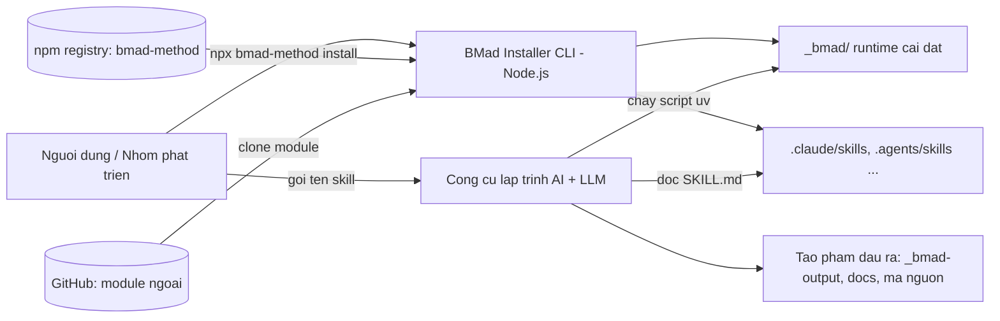
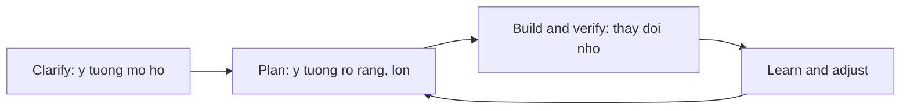

# 01 — Đặc tả hệ thống (System Specification)

> Tài liệu đặc tả đầy đủ cho **BMAD-METHOD v6.10.0** (`bmad-method`).
> Nguồn dữ liệu: mã nguồn trong `src/`, `tools/`, `test/`, `docs/`, `website/`, `web-bundles/` của chính repo này.
> Quay lại [mục lục](./README.md).

---

## Mục lục

1. [Giới thiệu](#1-giới-thiệu)
2. [Tổng quan hệ thống](#2-tổng-quan-hệ-thống)
3. [Các bên liên quan và vai trò](#3-các-bên-liên-quan-và-vai-trò)
4. [Phạm vi hệ thống](#4-phạm-vi-hệ-thống)
5. [Yêu cầu chức năng (FR)](#5-yêu-cầu-chức-năng-fr)
6. [Yêu cầu phi chức năng (NFR)](#6-yêu-cầu-phi-chức-năng-nfr)
7. [Đặc tả giao diện](#7-đặc-tả-giao-diện)
8. [Đặc tả dữ liệu và tạo phẩm](#8-đặc-tả-dữ-liệu-và-tạo-phẩm)
9. [Ràng buộc và giả định](#9-ràng-buộc-và-giả-định)
10. [Quy tắc nghiệp vụ](#10-quy-tắc-nghiệp-vụ)
11. [Tiêu chí chấp nhận](#11-tiêu-chí-chấp-nhận)
12. [Thuật ngữ](#12-thuật-ngữ)

---

## 1. Giới thiệu

### 1.1 Mục đích tài liệu

Tài liệu này đặc tả **cái gì** hệ thống BMAD-METHOD phải làm: phạm vi, chức năng, dữ liệu, giao diện, ràng buộc và tiêu chí chấp nhận. Tài liệu thiết kế (*làm như thế nào*) nằm ở [02 — Thiết kế hệ thống](./02-thiet-ke-he-thong.md); tài liệu vận hành nằm ở [03 — Vận hành hệ thống](./03-van-hanh-he-thong.md).

### 1.2 Danh tính sản phẩm

| Thuộc tính | Giá trị |
| --- | --- |
| Tên gói npm | `bmad-method` |
| Phiên bản | `6.10.0` |
| Khẩu hiệu | *Breakthrough Method of Agile AI-driven Development* |
| Tác giả | Brian (BMad) Madison |
| Giấy phép | MIT (nhãn hiệu **BMad**, **BMAD-METHOD** thuộc BMad Code, LLC) |
| Điểm vào CLI | `tools/installer/bmad-cli.js` (lệnh `bmad`, `bmad-method`) |
| Kho mã | https://github.com/bmad-code-org/BMAD-METHOD |
| Tài liệu chính thức | https://docs.bmad-method.org |

### 1.3 Bản chất hệ thống

BMAD-METHOD **không phải là một ứng dụng chạy thường trú**. Nó là:

- Một **trình cài đặt (installer) CLI viết bằng Node.js** đóng vai trò *bộ phân phối*.
- Một **thư viện tạo phẩm tri thức** dạng Markdown/TOML/CSV: các *skill* (kỹ năng), *agent* (nhân vật chuyên gia), *workflow* (quy trình), *template*, *reference*.
- Một **bộ script Python nhỏ (chạy bằng `uv`)** đóng vai trò *thời gian chạy tất định*: hợp nhất cấu hình, kết xuất workflow, ghi nhật ký bộ nhớ phiên.

"Bộ xử lý" thực sự của các workflow chính là **LLM trong công cụ lập trình AI của người dùng** (Claude Code, Cursor, Codex, Copilot…). BMAD cung cấp cho LLM đó: chỉ dẫn có cấu trúc, ngữ cảnh bền vững, các điểm dừng bắt buộc để con người quyết định, và các script tất định thay cho việc "đoán".

---

## 2. Tổng quan hệ thống

### 2.1 Bối cảnh



### 2.2 Ba mặt phẳng của hệ thống

| Mặt phẳng | Thành phần | Ngôn ngữ | Trách nhiệm |
| --- | --- | --- | --- |
| **Phân phối** | `tools/installer/**` | Node.js ≥ 20.12 | Cài đặt, cập nhật, gỡ bỏ, sinh manifest, tích hợp IDE |
| **Nội dung** | `src/core-skills/**`, `src/bmm-skills/**` | Markdown + TOML + CSV | Định nghĩa skill, agent, workflow, template, tri thức |
| **Thời gian chạy** | `src/scripts/**` + `scripts/` trong từng skill | Python ≥ 3.11 (qua `uv`) | Hợp nhất cấu hình, kết xuất snapshot, memlog, tính toán tất định |

### 2.3 Vòng đời giao hàng (BMad Delivery Loop)



Nguyên tắc: **bắt đầu ở bất kỳ đâu**. Thay đổi nhỏ đi thẳng vào Build; sáng kiến lớn đi qua đầy đủ 4 pha.

### 2.4 Bốn pha của module BMM

| Pha | Tên | Bắt buộc | Đầu ra tiêu biểu |
| --- | --- | --- | --- |
| 1 | Analysis (Phân tích) | Không | brainstorm, forged idea, research, product brief, PRFAQ |
| 2 | Planning (Lập kế hoạch) | Có (PRD) | `prd.md`, `DESIGN.md` + `EXPERIENCE.md`, `SPEC.md` |
| 3 | Solutioning (Giải pháp) | Có | `ARCHITECTURE-SPINE.md`, epics & stories, `sprint-status.yaml` |
| 4 | Implementation (Thực thi) | Có | `spec-*.md` + mã nguồn, review, retrospective |

---

## 3. Các bên liên quan và vai trò

### 3.1 Vai trò người thật

| Vai trò | Quan tâm chính | Điểm chạm |
| --- | --- | --- |
| Lập trình viên cá nhân | Chuyển ý tưởng thành mã nhanh, không mất kiểm soát | `bmad-build`, `bmad-help` |
| Product Manager | Yêu cầu rõ ràng, có thể truy vết | `bmad-prd`, `bmad-product-brief`, `bmad-prfaq` |
| Kiến trúc sư | Quyết định kỹ thuật hiển ngôn, không phân kỳ | `bmad-architecture` |
| UX Designer | Trải nghiệm nhất quán | `bmad-ux` |
| QA / Test Architect | Độ phủ kiểm thử, khoảng trống xác minh | `bmad-review`, `bmad-qa-generate-e2e-tests`, module `tea` |
| Trưởng nhóm / Enterprise | Chuẩn hóa, pin phiên bản, override tập trung | `_bmad/custom/*.toml`, `--pin`, `--set` |
| Người đóng góp mã | Chất lượng, kiểm thử, phát hành | `npm run quality`, CI GitHub Actions |

### 3.2 Vai trò agent (nhân vật AI) — module BMM

Khai báo tại `src/bmm-skills/module.yaml` → `agents:`, đội `software-development`.

| Mã skill | Tên | Chức danh | Icon | Cá tính cốt lõi |
| --- | --- | --- | --- | --- |
| `bmad-agent-analyst` | Mary | Business Analyst | 📊 | Chặt chẽ kiểu Porter, kim tự tháp Minto, mọi phát hiện phải có bằng chứng |
| `bmad-agent-pm` | John | Product Manager | 📋 | Jobs-to-be-Done, hỏi ngắn, truy vấn liên tục "tại sao" |
| `bmad-agent-ux-designer` | Sally | UX Designer | 🎨 | Đồng cảm + nghiêm ngặt với ca biên, kể chuyện người dùng |
| `bmad-agent-architect` | Winston | System Architect | 🏗️ | Ưu tiên công nghệ "nhàm chán", luôn trình bày đánh đổi |
| `bmad-agent-dev` | Amelia | Senior Software Engineer | 💻 | TDD đỏ–xanh–refactor, 100% pass mới review, nói bằng đường dẫn file và mã AC |

Người dùng có thể **thêm agent riêng** (thật hoặc hư cấu) qua `_bmad/custom/config.toml` hoặc `_bmad/custom/config.user.toml`.

---

## 4. Phạm vi hệ thống

### 4.1 Trong phạm vi

- Cài đặt/cập nhật/gỡ bỏ BMad vào một thư mục dự án bất kỳ.
- Đăng ký skill vào ~50 công cụ lập trình AI (xem `tools/installer/ide/platform-codes.yaml`).
- Cung cấp module `core` (8 skill dùng chung) và `bmm` (BMad Method, 4 pha).
- Cung cấp cơ chế tùy biến 3 lớp (mặc định → nhóm → cá nhân) không cần sửa mã nguồn.
- Kết xuất workflow thành snapshot bất biến, có hash, kiểm chứng được.
- Giải quyết phiên bản module ngoài theo kênh `stable` / `next` / `pinned`.
- Đóng gói web bundle cho Gemini Gems / ChatGPT Custom GPTs.
- Sinh website tài liệu (Astro + Starlight) từ `docs/`.

### 4.2 Ngoài phạm vi

- Không cung cấp LLM, không gọi API mô hình, không quản lý khóa API.
- Không phải IDE, không phải trình soạn thảo, không có giao diện đồ họa thường trú.
- Không chạy CI/CD cho dự án của người dùng.
- Không lưu trữ dữ liệu người dùng trên máy chủ; mọi tạo phẩm nằm trên đĩa cục bộ.
- Không thực thi mã của workflow — LLM là bộ thực thi.

---

## 5. Yêu cầu chức năng (FR)

### 5.1 Nhóm FR-INST — Cài đặt và vòng đời

| ID | Yêu cầu | Nguồn |
| --- | --- | --- |
| FR-INST-01 | Hệ thống phải cài đặt được qua `npx bmad-method install` mà không cần cài toàn cục. | `package.json:bin` |
| FR-INST-02 | Luồng tương tác phải hỏi tối thiểu: thư mục cài, module, kênh phiên bản, công cụ/IDE, cấu hình từng module. | `tools/installer/ui.js`, `docs/how-to/install-bmad.md` |
| FR-INST-03 | Phải hỗ trợ chế độ không tương tác (`--yes`) đầy đủ cho CI. | `commands/install.js` |
| FR-INST-04 | Khi phát hiện `_bmad/` đã tồn tại, phải cho chọn **Quick Update** (giữ nguyên thiết lập) hoặc **Modify Install** (luồng đầy đủ). | `core/existing-install.js`, `core/installer.js:quickUpdate` |
| FR-INST-05 | Phải phân loại nâng cấp patch/minor/major; major mặc định **không** tự áp dụng. | `modules/version-resolver.js` |
| FR-INST-06 | Phải hỗ trợ gỡ cài đặt (`uninstall`) gồm: module, cấu hình IDE, thư mục đầu ra. | `commands/uninstall.js` |
| FR-INST-07 | Phải báo cáo trạng thái cài đặt (`status`). | `commands/status.js` |
| FR-INST-08 | Phải kiểm tra tiền điều kiện: Node ≥ 20.12, sự hiện diện của `uv`, cảnh báo Node của Windows chạy trong WSL. | `core/uv-check.js`, `core/wsl-node-check.js` |
| FR-INST-09 | Phải tự kiểm tra phiên bản mới trên npm (dist-tag `latest`/`next`) và thông báo, không chặn. | `bmad-cli.js:checkForUpdate` |
| FR-INST-10 | Phải bảo toàn file người dùng đã tạo/sửa trong `_bmad/` khi cập nhật (khôi phục file custom, lưu `.bak` cho file bị sửa). | `installer.js:_restoreUserFiles`, `_backupUserFiles` |

### 5.2 Nhóm FR-MOD — Module

| ID | Yêu cầu |
| --- | --- |
| FR-MOD-01 | Module `core` luôn được cài, không thể bỏ chọn (tự thêm vào danh sách). |
| FR-MOD-02 | Module `bmm` được chọn mặc định (`default_selected: true`). |
| FR-MOD-03 | Đăng ký module chính thức phải nằm ở `bmad-modules.yaml` (nguồn sự thật duy nhất). |
| FR-MOD-04 | Mỗi module ngoài phải cài được theo 3 kênh: `stable` (tag semver cao nhất, loại prerelease), `next` (HEAD của main), `pinned` (tag chỉ định). |
| FR-MOD-05 | Thứ tự ưu tiên cờ: `--pin` > `--next=` > `--channel`/`--all-*` > mặc định trong registry. |
| FR-MOD-06 | Module `core` và `bmm` **đóng gói kèm installer**, không có kênh riêng; `--pin bmm=...` phải bị bỏ qua kèm cảnh báo. |
| FR-MOD-07 | Module đánh dấu `deprecated: true` bị ẩn khỏi bộ chọn trừ khi đã được cài. |
| FR-MOD-08 | `aliases` phải cho phép migrate mã module cũ (ví dụ `bauto` → `bmad-loop`) mà không mồ côi bản cài. |
| FR-MOD-09 | Module có `marketplace-plugin: true` phải phân giải skill qua `.claude-plugin/marketplace.json`. |
| FR-MOD-10 | Phải hỗ trợ module cộng đồng/riêng qua `--custom-source <git-url \| local-path>`. |
| FR-MOD-11 | `post-install-message` phải hiển thị sau cài; chế độ tương tác yêu cầu người dùng xác nhận. |

Danh sách module chính thức hiện hành:

| Mã | Tên | Mục đích | Mặc định chọn |
| --- | --- | --- | --- |
| `core` | BMad Core Module | Tiện ích dùng chung | Luôn cài |
| `bmm` | BMad Method | Agile AI-Driven Development | Có |
| `bmb` | BMad Builder | Trình dựng skill/workflow/agent | Không |
| `cis` | Creative Intelligence Suite | Đối tác tư duy sáng tạo | Không |
| `tea` | BMad Test Architect | Bổ trợ kiểm thử cấp doanh nghiệp | Không |
| `bmad-loop` | BMad Loop | Chạy trọn epic không giám sát | Không |
| `gds` | Game Dev Studio | Thiết kế và làm game | Không |
| `automator` | *(deprecated)* | Thay bằng `bmad-loop` | Ẩn |
| `wds` | *(deprecated)* Whiteport Design Studio | Gộp dần vào `bmm` | Ẩn |

### 5.3 Nhóm FR-CFG — Cấu hình

| ID | Yêu cầu |
| --- | --- |
| FR-CFG-01 | Cấu hình trung tâm phải là **4 lớp TOML** hợp nhất theo thứ tự: `_bmad/config.toml` → `_bmad/config.user.toml` → `_bmad/custom/config.toml` → `_bmad/custom/config.user.toml`. |
| FR-CFG-02 | Hai lớp đầu do installer sinh và **ghi đè mỗi lần cài**; hai lớp `custom/` installer **không bao giờ chạm vào**. |
| FR-CFG-03 | Câu hỏi có `scope: user` phải đi vào `config.user.toml`; còn lại vào `config.toml`. |
| FR-CFG-04 | Tùy biến skill phải là **3 lớp TOML**: `<skill>/customize.toml` → `_bmad/custom/<skill>.toml` → `_bmad/custom/<skill>.user.toml`. |
| FR-CFG-05 | Quy tắc hợp nhất cấu trúc: **scalar** — lớp sau thắng; **table** — deep merge; **mảng thường** — nối thêm; **mảng bảng có khóa `code`/`id`** — trùng khóa thì thay thế, khóa mới thì nối thêm. |
| FR-CFG-06 | `_bmad/custom/.gitignore` phải chứa `*.user.toml` để lớp cá nhân không bị commit. |
| FR-CFG-07 | `--set <module>.<key>=<value>` phải áp dụng như bản vá TOML **sau khi** cài xong, ghi vào đúng file theo scope, và ghi thêm vào `_bmad/<module>/config.yaml` để giữ giá trị cho lần cài kế tiếp. |
| FR-CFG-08 | `--list-options [module]` phải liệt kê mọi khóa `--set` khả dụng rồi thoát. |

Khóa cấu hình module `core` (`src/core-skills/module.yaml`):

| Khóa | Scope | Mặc định | Ý nghĩa |
| --- | --- | --- | --- |
| `user_name` | user | `BMad` | Tên agent dùng để xưng hô |
| `project_name` | team | tên thư mục | Tên dự án |
| `communication_language` | user | `English` | Ngôn ngữ hội thoại |
| `document_output_language` | team | `English` | Ngôn ngữ tài liệu đầu ra |
| `output_folder` | team | `_bmad-output` | Thư mục đầu ra (đường dẫn tuyệt đối sau khi phân giải) |

Khóa cấu hình module `bmm` (`src/bmm-skills/module.yaml`):

| Khóa | Scope | Mặc định | Ý nghĩa |
| --- | --- | --- | --- |
| `user_skill_level` | user | `intermediate` | `beginner` / `intermediate` / `expert` — ảnh hưởng cách agent giải thích |
| `planning_artifacts` | team | `{output_folder}/planning-artifacts` | Nơi lưu tạo phẩm pha 1–3 |
| `implementation_artifacts` | team | `{output_folder}/implementation-artifacts` | Nơi lưu tạo phẩm pha 4 |
| `project_knowledge` | team | `docs` | Tri thức dài hạn: nghiên cứu, tài liệu tham chiếu |

### 5.4 Nhóm FR-SKILL — Skill và Agent

| ID | Yêu cầu |
| --- | --- |
| FR-SKILL-01 | Mỗi skill là **một thư mục** chứa `SKILL.md` với YAML frontmatter gồm `name` và `description`. |
| FR-SKILL-02 | `name` phải khớp **chính xác** tên thư mục, theo regex `^bmad-[a-z0-9]+(-[a-z0-9]+)*$`. |
| FR-SKILL-03 | `description` ≤ 1024 ký tự, phải nêu **cả** *làm gì* **và** *khi nào dùng*. |
| FR-SKILL-04 | Skill có thể kèm: `customize.toml`, `references/`, `assets/`, `scripts/`, `steps/`, `templates/`, `types/`, `review-prompts/`, `workflow.md`. |
| FR-SKILL-05 | Tham chiếu nội bộ phải là đường dẫn tương đối từ file gốc; cấm biến frontmatter trỏ vào file trong chính skill. |
| FR-SKILL-06 | Cấm tham chiếu vào thư mục của skill khác (PATH-05). |
| FR-SKILL-07 | Skill dạng workflow kết xuất phải dùng `SKILL.md` tối giản gọi `render_skill.py`, và toàn bộ logic nằm trong `workflow.md` + các file bước. |
| FR-SKILL-08 | Agent persona phải khai báo `[agent]` trong `customize.toml`; workflow khai báo `[workflow]`; skill độc lập không có `customize.toml`. |
| FR-SKILL-09 | Skill v6-shim phải chuyển tiếp ID cũ sang skill mới để không phá bản cài cũ. |

Danh mục skill **module `core`** (8 skill + 6 shim):

| Skill | Mã menu | Pha | Đầu ra |
| --- | --- | --- | --- |
| `bmad-help` | BH | anytime | Hướng dẫn bước kế tiếp |
| `bmad-advanced-elicitation` | AE | anytime | Bản tinh chỉnh của nội dung vừa tạo |
| `bmad-review` | RV | anytime | Mảng JSON findings + báo cáo markdown |
| `bmad-customize` | BC | anytime | File TOML override trong `_bmad/custom/` |
| `bmad-brainstorming` | BSP/BP | anytime/plan | `brainstorm.html`, `brainstorm-intent.md`, `.memlog.md` |
| `bmad-deep-recon` | RS | anytime | `research.md` + HTML briefing tùy chọn |
| `bmad-forge-idea` | FI | anytime | `forge-report.html`, `forged-idea.md` (tùy chọn) |
| `bmad-party-mode` | PM | anytime | Hội thoại đa agent + keepsake HTML |

Danh mục skill **module `bmm`** (17 mục menu + 13 shim):

| Skill | Mã | Pha | Bắt buộc | Đầu ra |
| --- | --- | --- | --- | --- |
| `bmad-project-context` | PC | anytime | Không | Khối quản lý trong `AGENTS.md` |
| `bmad-product-brief` | CB | plan | Không | `brief.md`, `addendum.md` |
| `bmad-prfaq` | WB | plan | Không | `prfaq-{project}.md` |
| `bmad-prd` | PRD | planning | **Có** | `prd.md`, `addendum.md`, `.memlog.md`, báo cáo validate HTML |
| `bmad-ux` | CU | planning | Không | `DESIGN.md`, `EXPERIENCE.md` |
| `bmad-spec` | SPC | anytime | Không | `SPEC.md` + companion, `stories.yaml` (tùy chọn) |
| `bmad-architecture` | CA | plan | **Có** | `ARCHITECTURE-SPINE.md` |
| `bmad-create-epics-and-stories` | CE | plan | **Có** | File epic chứa story |
| `bmad-sprint-planning` | SP | plan | **Có** | Verdict PASS/CONCERNS/FAIL + `sprint-status.yaml` |
| `bmad-sprint-planning` (action `status`) | SS | anytime | Không | Bản tóm tắt trạng thái sprint |
| `bmad-build` | BD | ship | **Có** | `spec-*.md` + mã nguồn |
| `bmad-build-auto` | — | ship | Không | Vòng lặp thực thi không giám sát |
| `bmad-code-review` | CR | ship | Không | Findings + patch áp dụng |
| `bmad-checkpoint-preview` | CK | ship | Không | Hướng dẫn duyệt commit/branch/PR |
| `bmad-qa-generate-e2e-tests` | QA | ship | Không | Bộ test API/E2E |
| `bmad-retrospective` | ER | ship | Không | Tài liệu retro, action item, verdict |
| `bmad-correct-course` | CC | anytime | Không | Đề xuất thay đổi |

### 5.5 Nhóm FR-RENDER — Kết xuất workflow

| ID | Yêu cầu |
| --- | --- |
| FR-RENDER-01 | `render_skill.py` phải nạp **mọi** file `.md` trong thư mục skill trừ `SKILL.md`; bắt buộc phải có `workflow.md`. |
| FR-RENDER-02 | Phải thay thế 4 loại token: `{{config.<đường.dẫn>}}`, `{{.<khóa>}}` (tra cứu ngắn, phải duy nhất), `{workflow.<trường>}` (từ customize hợp nhất), `[[bmad-snapshot:<file>.md]]` (đường dẫn tuyệt đối tới file trong snapshot). |
| FR-RENDER-03 | Token `{{.<khóa>}}` mơ hồ (trùng ở nhiều nhánh config) phải gây lỗi, không được đoán. |
| FR-RENDER-04 | Snapshot phải nằm tại `_bmad/render/<skill>/<slug>-<hash12 project-root>/<generation_hash20>/`. |
| FR-RENDER-05 | `generation_hash` phải tính từ: đường dẫn project root + SHA-256 của chính renderer + toàn bộ giá trị đã phân giải + SHA-256 từng file nguồn. |
| FR-RENDER-06 | Publish phải **nguyên tử**: ghi vào thư mục staging tạm rồi `os.rename`. |
| FR-RENDER-07 | Nếu thư mục generation đã tồn tại, phải xác minh `manifest.json` khớp tuyệt đối và hash từng file đúng; sai lệch ⇒ lỗi "generation collision or corruption". |
| FR-RENDER-08 | Thành công phải in ra stdout đúng một dòng: `read and follow <đường dẫn tuyệt đối>/workflow.md`. |
| FR-RENDER-09 | Thất bại phải in `HALT: <lý do>` và trả mã thoát 1; LLM **không được** chạy file nguồn trực tiếp. |
| FR-RENDER-10 | `_bmad/render/.gitignore` phải chứa `*` và `!.gitignore` (snapshot không vào version control). |

### 5.6 Nhóm FR-IDE — Tích hợp công cụ

| ID | Yêu cầu |
| --- | --- |
| FR-IDE-01 | Phải hỗ trợ ~50 nền tảng khai báo trong `platform-codes.yaml`, mỗi nền tảng có `target_dir` (dự án) và tùy chọn `global_target_dir` (thư mục người dùng). |
| FR-IDE-02 | Nền tảng `preferred: true` (Claude Code, Codex, Cursor, GitHub Copilot) phải hiển thị như lựa chọn đề xuất. |
| FR-IDE-03 | Việc cài skill vào IDE là **sao chép thư mục** (không symlink), có làm sạch đích trước để tránh file cũ tồn dư. |
| FR-IDE-04 | Nền tảng có `commands_target_dir` phải sinh thêm file lệnh (ví dụ `.github/agents/*.agent.md`, `.opencode/commands/`). |
| FR-IDE-05 | `commands_filter: agents-only` phải lọc chỉ persona agent bằng cách đọc `customize.toml` và kiểm tra sự tồn tại của mục `[agent]` — không dựa vào quy ước đặt tên. |
| FR-IDE-06 | `--list-tools` phải in mọi mã công cụ hợp lệ kèm thư mục đích rồi thoát. |
| FR-IDE-07 | Cài không tương tác lần đầu (`--yes`) **bắt buộc** phải có `--tools`. |
| FR-IDE-08 | `--action update` phải tái sử dụng danh sách công cụ đã cấu hình trước đó. |

### 5.7 Nhóm FR-MANIFEST — Kê khai và truy vết

| ID | Yêu cầu | File sinh ra |
| --- | --- | --- |
| FR-MANIFEST-01 | Phải ghi manifest chính liệt kê module, version, channel, sha, source, repoUrl. | `_bmad/_config/manifest.yaml` |
| FR-MANIFEST-02 | Phải ghi danh mục skill đã cài. | `_bmad/_config/skill-manifest.csv` (`canonicalId,name,description,module,path`) |
| FR-MANIFEST-03 | Phải ghi kê khai file kèm hash để phát hiện file người dùng thêm/sửa. | `_bmad/_config/files-manifest.csv` |
| FR-MANIFEST-04 | Phải gộp `module-help.csv` của mọi module thành catalog trợ giúp thống nhất. | `_bmad/_config/bmad-help.csv` |
| FR-MANIFEST-05 | Phải ghi bảng `[agents.<code>]` vào `config.toml` từ `agents:` trong `module.yaml`; module được bảo toàn phải giữ nguyên khối agent cũ. | `_bmad/config.toml` |
| FR-MANIFEST-06 | Với module lấy từ git, phải ghi `sha`; module đóng gói và module đường dẫn cục bộ không có `sha`. | `manifest.yaml` |

Lược đồ `module-help.csv` (13 cột):

```
module,skill,display-name,menu-code,description,action,args,phase,preceded-by,followed-by,required,output-location,outputs
```

- Dòng có `skill = _meta` mang URL tài liệu module trong cột `output-location` (ví dụ `https://docs.bmad-method.org/llms.txt`).
- `phase = anytime` ⇒ dùng bất kỳ lúc nào; các giá trị khác nhóm theo thư mục (`plan`, `ship`) hoặc pha đánh số.
- `preceded-by` / `followed-by` là **gợi ý mềm**; `required = true` mới là cổng chặn thật.

### 5.8 Nhóm FR-MEM — Bộ nhớ phiên

| ID | Yêu cầu |
| --- | --- |
| FR-MEM-01 | `memlog.py` phải tạo/ghi file `.memlog.md` **chỉ nối thêm**, theo thứ tự thời gian, không bao giờ sửa/xóa/sắp xếp lại. |
| FR-MEM-02 | Không có lệnh `edit` hay `delete` — theo thiết kế. |
| FR-MEM-03 | Mọi ghi phải nguyên tử: ghi file tạm → flush → fsync → rename đè. |
| FR-MEM-04 | Mỗi lệnh phải echo trạng thái mới dưới dạng một dòng JSON để bên gọi không phải đọc lại file giữa phiên. |
| FR-MEM-05 | Mỗi mục có thể mang `--type` (idea/insight/question/decision/direction/assumption/gap/note/event…) và `--by` (user/coach…). |
| FR-MEM-06 | Script **không** áp đặt từ vựng; skill chủ gọi quyết định. |

### 5.9 Nhóm FR-DOC — Tài liệu và web bundle

| ID | Yêu cầu |
| --- | --- |
| FR-DOC-01 | Website tài liệu phải dựng từ `docs/` bằng Astro + Starlight (`npm run docs:build`). |
| FR-DOC-02 | Phải kiểm tra liên kết tài liệu (`docs:validate-links`) và thứ tự sidebar (`docs:validate-sidebar`). |
| FR-DOC-03 | Phải hỗ trợ đa ngữ: `cs`, `fr`, `vi-vn`, `zh-cn` bên cạnh tiếng Anh. |
| FR-DOC-04 | Web bundle phải đóng gói các workflow chọn lọc thành Gems/Custom GPTs (`npm run rebundle`). |

Bundle hiện có: `brainstorming-coach`, `market-and-industry-research`, `prd-coach`, `prfaq-coach`, `product-brief-coach`, `ux-coach`.

---

## 6. Yêu cầu phi chức năng (NFR)

### 6.1 Tính tất định và toàn vẹn

| ID | Yêu cầu | Cơ chế |
| --- | --- | --- |
| NFR-DET-01 | Kết xuất workflow phải tất định: cùng đầu vào ⇒ cùng `generation_hash` ⇒ tái dùng snapshot cũ. | SHA-256 trên JSON chuẩn hóa (`sort_keys`, `separators=(",",":")`) |
| NFR-DET-02 | Không được publish snapshot nửa vời khi hệ thống sập. | staging dir + `os.rename` nguyên tử |
| NFR-DET-03 | Không được ghi đè âm thầm khi phát hiện xung đột generation. | `_verify_existing` so khớp manifest + hash từng file |
| NFR-DET-04 | Ghi memlog không được để lại bản ghi cụt. | temp + flush + fsync + rename |
| NFR-DET-05 | Đường dẫn nguồn kết xuất không được thoát khỏi thư mục skill. | kiểm tra `is_relative_to(skill_dir)` |

### 6.2 Khả năng tương thích

| ID | Yêu cầu |
| --- | --- |
| NFR-COMPAT-01 | Node.js ≥ 20.12.0 (khai báo trong `engines`). |
| NFR-COMPAT-02 | Python ≥ 3.11 cho script runtime (dùng `tomllib` stdlib); thiếu ⇒ thoát mã 3 với thông báo rõ. `memlog.py` chỉ cần ≥ 3.8. |
| NFR-COMPAT-03 | Chạy được trên Windows, macOS, Linux; xử lý riêng stdin trên Windows và cảnh báo Node Windows chạy trong WSL. |
| NFR-COMPAT-04 | Skill phải chạy được trên runtime **không** hỗ trợ subagent (Copilot, Codex, Ollama cục bộ) — luôn phải có nhánh fallback nội tuyến. |
| NFR-COMPAT-05 | Skill ID cũ (v6 shim) phải tiếp tục phân giải. |

### 6.3 Hiệu năng và ngân sách ngữ cảnh

| ID | Yêu cầu |
| --- | --- |
| NFR-PERF-01 | Kiểm tra phiên bản npm phải bất đồng bộ, timeout 5 giây, thất bại im lặng. |
| NFR-PERF-02 | Catalog lớn (phương pháp elicitation, kỹ thuật brainstorming) **không được** nạp nguyên khối vào ngữ cảnh; phải phục vụ qua script (`pick_methods.py`, `brain.py`). |
| NFR-PERF-03 | Workflow phải nạp file bước **just-in-time**, mỗi lần một file. |
| NFR-PERF-04 | Spec của `bmad-build` nhắm 900–1600 token (dưới 900 dễ mơ hồ, trên 1600 gây "context rot"). Đây là **đề xuất**, người dùng có quyền vượt. |
| NFR-PERF-05 | Mỗi workflow nên chạy trong **cửa sổ ngữ cảnh mới**. |

### 6.4 Bảo mật và riêng tư

| ID | Yêu cầu |
| --- | --- |
| NFR-SEC-01 | Không thu thập telemetry, không gửi mã nguồn người dùng đi đâu. |
| NFR-SEC-02 | `GITHUB_TOKEN` chỉ dùng để nâng hạn mức API GitHub (60/giờ ẩn danh → 5000/giờ); không yêu cầu scope nào. |
| NFR-SEC-03 | Lớp cấu hình cá nhân (`*.user.toml`) phải bị gitignore mặc định. |
| NFR-SEC-04 | Snapshot kết xuất phải bị gitignore. |
| NFR-SEC-05 | Script cài đặt không được ghi `__pycache__`, `.pyc`, thư mục `tests/` vào dự án người dùng. |
| NFR-SEC-06 | Chính sách báo lỗi bảo mật theo `SECURITY.md`. |

### 6.5 Khả năng bảo trì và chất lượng

| ID | Yêu cầu | Kiểm chứng |
| --- | --- | --- |
| NFR-MAINT-01 | Mọi commit theo Conventional Commits. | `AGENTS.md`, husky hook |
| NFR-MAINT-02 | Trước khi push phải chạy `npm ci && npm run quality` trên đúng checkout sắp push. | `AGENTS.md` |
| NFR-MAINT-03 | Skill phải qua bộ validator 26 quy tắc (13 quy tắc tất định + 13 quy tắc suy luận). | `tools/validate-skills.js`, `tools/skill-validator.md` |
| NFR-MAINT-04 | Mọi tham chiếu file trong skill phải hợp lệ. | `npm run validate:refs --strict` |
| NFR-MAINT-05 | Định dạng thống nhất bằng Prettier; lint bằng ESLint (max-warnings=0) + markdownlint. | `npm run quality` |
| NFR-MAINT-06 | Script Python phải có unit test đi kèm trong `scripts/tests/`. | `npm run test:renderer`, `test:retrospective`, `test:sprint-planning` |

### 6.6 Khả dụng

| ID | Yêu cầu |
| --- | --- |
| NFR-UX-01 | Agent phải giao tiếp bằng `communication_language` và xuất tài liệu bằng `document_output_language`. |
| NFR-UX-02 | Agent phải chào người dùng bằng `user_name` và tiền tố mọi tin nhắn bằng `{agent.icon}`. |
| NFR-UX-03 | Độ sâu giải thích phải khớp `user_skill_level`. |
| NFR-UX-04 | `bmad-help` phải chỉ hiện phần liên quan tới vị trí hiện tại, không đổ toàn bộ catalog. |
| NFR-UX-05 | Mọi bước dừng bắt buộc (HALT) phải chờ con người trả lời, không tự quyết. |

---

## 7. Đặc tả giao diện

### 7.1 Giao diện dòng lệnh

```
bmad-method <command> [options]
```

**Lệnh `install`**

| Cờ | Mô tả |
| --- | --- |
| `-d, --debug` | Bật log gỡ lỗi khi sinh manifest (`BMAD_DEBUG_MANIFEST=true`) |
| `--directory <path>` | Thư mục cài (mặc định: thư mục hiện tại) |
| `--modules <a,b,c>` | Tập module chính xác (không phải delta); `core` tự thêm |
| `--tools <a,b>` | Danh sách IDE/công cụ; bắt buộc khi cài mới với `--yes` |
| `--list-tools` | In mọi mã công cụ rồi thoát |
| `--set <mod>.<key>=<val>` | Đặt tùy chọn cấu hình module (lặp lại được) |
| `--list-options [module]` | In khóa `--set` khả dụng rồi thoát |
| `--action <type>` | `install` \| `update` \| `quick-update` |
| `--user-name <name>` | Tương đương `--set core.user_name=` |
| `--communication-language <lang>` | Tương đương `--set core.communication_language=` |
| `--document-output-language <lang>` | Tương đương `--set core.document_output_language=` |
| `--output-folder <path>` | Tương đương `--set core.output_folder=` |
| `--custom-source <urls>` | Git URL hoặc đường dẫn cục bộ của module riêng |
| `-y, --yes` | Nhận mặc định, bỏ prompt |
| `--channel <stable\|next>` | Áp cho mọi module ngoài |
| `--all-stable` / `--all-next` | Bí danh của `--channel` |
| `--next <code>` | Đưa một module về HEAD của main (lặp lại được) |
| `--pin <code>=<tag>` | Ghim module vào tag cụ thể (lặp lại được) |

**Lệnh `status`** — báo cáo trạng thái bản cài.
**Lệnh `uninstall`** — gỡ module, cấu hình IDE, thư mục đầu ra.

Mã thoát: `0` thành công/hủy có chủ ý; `1` lỗi cài đặt hoặc `--list-options` không tìm thấy module; `3` thiếu Python 3.11 (script runtime).

### 7.2 Giao diện script Python (hợp đồng gọi từ LLM)

| Script | Lệnh mẫu | Trả về |
| --- | --- | --- |
| `resolve_config.py` | `uv run {project-root}/_bmad/scripts/resolve_config.py --project-root {project-root} [--key core] [--key agents]` | JSON cấu hình hợp nhất (4 lớp) |
| `resolve_customization.py` | `uv run {project-root}/_bmad/scripts/resolve_customization.py --skill {skill-root} --key workflow` | JSON tùy biến hợp nhất (3 lớp) |
| `render_skill.py` | `uv run --no-cache "{project-root}/_bmad/scripts/render_skill.py" --project-root "{project-root}" --skill "{skill-root}"` | `read and follow <path>/workflow.md` hoặc `HALT: <lý do>` |
| `memlog.py` | `uv run {project-root}/_bmad/scripts/memlog.py init\|append\|set --workspace <dir> ...` | Một dòng JSON trạng thái mới |

Script riêng của skill (ví dụ):

| Script | Vai trò |
| --- | --- |
| `bmad-advanced-elicitation/scripts/pick_methods.py` | Phục vụ catalog phương pháp: `categories`, `list`, `show`, `random -n 5 --spread` |
| `bmad-brainstorming/scripts/brain.py` | Phục vụ thư viện kỹ thuật + sinh trang chọn `brain-selector.html` |
| `bmad-customize/scripts/list_customizable_skills.py` | Quét skill có thể tùy biến, báo `has_team_override` / `has_user_override` |
| `bmad-party-mode/scripts/resolve_party.py` | Phân giải roster, `party_mode`, `memory_enabled`, scene/`open_cast` |
| `bmad-forge-idea/scripts/resolve_personas.py` | Phân giải persona tham gia chất vấn |
| `bmad-deep-recon/scripts/recon_kit.py` | Bộ công cụ nghiên cứu |
| `bmad-review/scripts/word_metrics.py` | Đo chỉ số văn bản cho lens biên tập |
| `bmad-sprint-planning/scripts/sprint_plan.py` | `generate` / `status` / `validate` file `sprint-status.yaml` |
| `bmad-retrospective/scripts/git_evidence.py`, `sprint_status.py` | Thu bằng chứng từ git và trạng thái sprint |
| `bmad-architecture/scripts/lint_spine.py` | Lint `ARCHITECTURE-SPINE.md` |

### 7.3 Giao diện người–AI

- Người dùng gõ **tên skill** trong công cụ AI (ví dụ `bmad-build thêm nút xuất CSV`).
- Hoặc nạp một **agent** trước (`bmad-agent-dev`) rồi chọn mục trong menu bằng mã (`BD`, `CR`, `QA`, `SP`, `ER`), số thứ tự, hoặc mô tả gần đúng.
- Menu agent được render dạng bảng đánh số: `Code`, `Description`, `Action`.

### 7.4 Giao diện file — bố cục `_bmad/` sau khi cài

```
<project-root>/
├── _bmad/
│   ├── config.toml                  # installer sinh, scope nhóm      (đọc-chỉ)
│   ├── config.user.toml             # installer sinh, scope cá nhân   (đọc-chỉ)
│   ├── _config/
│   │   ├── manifest.yaml            # module, version, channel, sha
│   │   ├── skill-manifest.csv       # canonicalId,name,description,module,path
│   │   ├── files-manifest.csv       # đường dẫn + hash để phát hiện sửa đổi
│   │   └── bmad-help.csv            # catalog trợ giúp gộp từ mọi module
│   ├── core/                        # skill module core
│   ├── bmm/                         # skill module bmm
│   │   └── config.yaml              # giá trị cấu hình để nhớ cho lần cài sau
│   ├── scripts/                     # bản sao runtime của src/scripts (không có tests)
│   ├── custom/                      # người dùng sở hữu — installer KHÔNG chạm
│   │   ├── .gitignore               # "*.user.toml"
│   │   ├── config.toml              # override tập trung, cấp nhóm
│   │   ├── config.user.toml         # override tập trung, cá nhân
│   │   ├── <skill>.toml             # override skill, cấp nhóm
│   │   └── <skill>.user.toml        # override skill, cá nhân
│   └── render/                      # snapshot kết xuất (gitignored)
│       ├── .gitignore               # "*" + "!.gitignore"
│       └── <skill>/<slug>-<hash>/<generation>/
│           ├── manifest.json
│           ├── workflow.md
│           └── step-*.md ...
├── .claude/skills/  (hoặc .agents/skills/, .cursor…)   # bản sao skill cho IDE
├── _bmad-output/
│   ├── planning-artifacts/          # pha 1–3
│   └── implementation-artifacts/    # pha 4
├── docs/                            # project_knowledge
└── AGENTS.md                        # khối project-context do bmad quản lý
```

---

## 8. Đặc tả dữ liệu và tạo phẩm

### 8.1 Bảng tạo phẩm theo pha

| Pha | Tạo phẩm | Định dạng | Nơi lưu | Skill sinh ra |
| --- | --- | --- | --- | --- |
| 1 | `brainstorm.html`, `brainstorm-intent.md` | HTML/MD | `{output_folder}/brainstorming` | `bmad-brainstorming` |
| 1 | `forge-report.html`, `forged-idea.md` | HTML/MD | `{output_folder}/forge` | `bmad-forge-idea` |
| 1 | `research.md` + briefing HTML | MD/HTML | `{planning_artifacts}/research` | `bmad-deep-recon` |
| 1 | `brief.md`, `addendum.md`, `.memlog.md` | MD | `{planning_artifacts}/briefs/brief-{project_name}-{date}/` | `bmad-product-brief` |
| 1 | `prfaq-{project}.md` | MD | `{planning_artifacts}` | `bmad-prfaq` |
| 2 | `prd.md`, `addendum.md`, `.memlog.md` | MD | `{planning_artifacts}/prds/prd-{project_name}-{date}/` | `bmad-prd` |
| 2 | `DESIGN.md`, `EXPERIENCE.md` | MD | `{planning_artifacts}/ux-designs/ux-{project_name}-{date}/` | `bmad-ux` |
| 2 | `SPEC.md` + companion, `stories.yaml` | MD/YAML | `{output_folder}/specs/spec-{slug}/` | `bmad-spec` |
| 3 | `ARCHITECTURE-SPINE.md` | MD | `{planning_artifacts}/architecture/architecture-{project_name}-{date}/` | `bmad-architecture` |
| 3 | `epics.md` (chứa story) | MD | `{planning_artifacts}` | `bmad-create-epics-and-stories` |
| 3 | `sprint-status.yaml` | YAML | `{implementation_artifacts}` | `bmad-sprint-planning` |
| 4 | `spec-{slug}.md` + mã nguồn | MD + code | `{implementation_artifacts}` + repo | `bmad-build` |
| 4 | `epic-<N>-context.md` | MD | `{implementation_artifacts}` | `bmad-build` (cache ngữ cảnh epic) |
| 4 | `deferred-work.md` | MD | `{implementation_artifacts}` | `bmad-build` (khi tách mục tiêu) |
| 4 | Findings JSON + báo cáo MD | JSON/MD | chat hoặc `report_path` | `bmad-review`, `bmad-code-review` |
| 4 | Tài liệu retro + action item | MD | `{implementation_artifacts}` | `bmad-retrospective` |

> ⭐ **Bốn skill dùng "thư mục chạy" (run folder), không ghi file phẳng.** Mẫu do
> `{workflow.run_folder_pattern}` trong `customize.toml` quyết định — mỗi lần chạy
> một thư mục riêng, nên chạy lại không đè lên lần trước:
>
> | Skill | `*_output_path` | `run_folder_pattern` |
> | --- | --- | --- |
> | `bmad-product-brief` | `{planning_artifacts}/briefs` | `brief-{project_name}-{date}` |
> | `bmad-prd` | `{planning_artifacts}/prds` | `prd-{project_name}-{date}` |
> | `bmad-ux` | `{planning_artifacts}/ux-designs` | `ux-{project_name}-{date}` |
> | `bmad-architecture` | `{planning_artifacts}/architecture` | `architecture-{project_name}-{date}` |
> | `bmad-spec` | `{output_folder}/specs` | `spec-{slug}` |
>
> Ngược lại, `bmad-create-epics-and-stories`, `bmad-sprint-planning`,
> `bmad-build` và `bmad-retrospective` **không** có `run_folder_pattern` —
> chúng ghi thẳng vào `{planning_artifacts}` hoặc `{implementation_artifacts}`.

### 8.2 Lược đồ `sprint-status.yaml`

```yaml
generated: MM-DD-YYYY HH:MM
last_updated: MM-DD-YYYY HH:MM
project: <tên dự án>
project_key: <mã>
tracking_system: file-system
story_location: "docs/stories"

development_status:
  epic-1: backlog | in-progress | done
  1-1-user-authentication: backlog | ready-for-dev | in-progress | review | done
  epic-1-retrospective: optional | done

action_items:
  - epic: 1
    action: "<hành động cam kết trong retro>"
    owner: "<người chịu trách nhiệm>"
    status: open | in-progress | done
```

Quy tắc chuyển trạng thái:

| Từ | Sang | Kích hoạt bởi |
| --- | --- | --- |
| `backlog` | `ready-for-dev` | File story được tạo |
| `ready-for-dev` | `in-progress` | Dev bắt đầu thực thi |
| `in-progress` | `review` | Thực thi xong |
| `review` | `done` | Review đạt |
| epic `backlog` | epic `in-progress` | Story đầu tiên bắt đầu (tự động qua sprint sync của `bmad-build`) |

### 8.3 Lược đồ frontmatter spec (`spec-*.md`)

| Trường | Giá trị hợp lệ | Ý nghĩa cho `bmad-build` |
| --- | --- | --- |
| `status` | `draft` | Định tuyến vào bước 02 — lập kế hoạch |
| | `ready-for-dev` | Định tuyến vào bước 03 — thực thi |
| | `in-progress` | Định tuyến vào bước 03 — thực thi |
| | `in-review` | Định tuyến vào bước 04 — review |
| | `done` | Nạp làm ngữ cảnh, **không** resume |
| `spec_file` | đường dẫn | Đặt lúc chạy |
| `story_key` | ví dụ `3-2-digest-delivery` | Khóa đầy đủ trong `sprint-status.yaml` |

### 8.4 Lược đồ `.memlog.md`

```markdown
---
topic: <chủ đề>
goal: <mục tiêu>
updated: 2026-06-07T14:22
---

- (note) user picked techniques: SCAMPER, then Six Thinking Hats
- (technique) started SCAMPER
- (idea by user) skip the signup wall: let people try with sample data first
- (question) is open-banking consent too heavy for step one?
- (decision) lead with one pre-categorized account
- (event) session complete
```

**Bất biến:** phẳng (không có mục con), chỉ nối thêm, theo thời gian, không trạng thái vòng đời trong frontmatter (trạng thái cũng là một mục log).

### 8.5 Lược đồ finding của `bmad-review`

Mọi lens trả về **một** mảng JSON; mỗi finding tối thiểu có:

| Trường | Ý nghĩa |
| --- | --- |
| `lens` | Mã lens đã sinh ra finding |
| `location` | `file:dòng-đầu-dòng-cuối` cho mã, tên mục cho tài liệu |
| `trigger_condition` | Vấn đề, hoặc điều kiện phơi bày vấn đề — một dòng |
| `guard_snippet` | Bản vá, guard, hoặc kiểm tra còn thiếu — cụ thể |
| `potential_consequence` | Hậu quả nếu ship nguyên trạng |

Lens có thể thêm trường riêng (`kind`/`confidence` cho finding xóa mã; `gap_shape`/`consumer`/`evidence` cho verification-gap). **Không có** severity, priority, hay xếp hạng ở bất kỳ đâu. `[]` là kết quả hợp lệ.

Bộ lens mặc định:

| Mã lens | Áp dụng cho | Phương pháp | Ràng buộc đặc biệt |
| --- | --- | --- | --- |
| `adversarial` | any | Review cưỡng bức phát hiện — tìm cả cái *thiếu* | **≥ 10** finding; danh sách rỗng bị coi là tín hiệu phải rà lại |
| `edge-case-hunter` | any | Duyệt mọi nhánh rẽ và điều kiện biên | Bỏ qua với văn bản không có bề mặt hành vi |
| `verification-gap` | code | Tìm hành vi đổi mà kiểm thử không bắt được | Chỉ chạy trong repo có test đọc được |
| `structure` | docs | Đề xuất cắt, gộp, di chuyển, cô đọng | Nội dung là bất khả xâm phạm |
| `prose` | docs | Biên tập câu chữ cho dễ hiểu | Chạy **sau** `structure` (`after = "structure"`) |

---

## 9. Ràng buộc và giả định

### 9.1 Ràng buộc kỹ thuật

| ID | Ràng buộc |
| --- | --- |
| C-01 | Node.js ≥ 20.12.0 để chạy installer. |
| C-02 | Python ≥ 3.10 và `uv` để chạy script runtime; `tomllib` yêu cầu 3.11 thực tế. |
| C-03 | Git bắt buộc để clone module ngoài. |
| C-04 | API GitHub ẩn danh giới hạn 60 lượt/giờ/IP — mỗi module ngoài tốn 1 lượt khi phân giải tag `stable`. |
| C-05 | Cài `stable` phân giải tag cao nhất **tại thời điểm cài** — không tái lập được nếu chỉ lặp lại cùng lệnh; muốn tái lập phải chuyển tag trong `manifest.yaml` thành `--pin`. |
| C-06 | `core` và `bmm` không có kênh riêng — gắn cứng với binary installer đã chạy. |
| C-07 | Skill cài vào IDE là **bản sao**; sửa trực tiếp ở đó sẽ bị mất khi cập nhật. |

### 9.2 Giả định

| ID | Giả định |
| --- | --- |
| A-01 | Người dùng đã có một công cụ lập trình AI với LLM đủ mạnh. |
| A-02 | Người dùng giữ quyền quyết định — hệ thống *không* thay con người ra quyết định. |
| A-03 | Dự án nằm dưới quản lý phiên bản (nhiều bước kiểm tra cây làm việc sạch; nếu không có VCS thì bỏ qua). |
| A-04 | Người dùng chấp nhận tạo phẩm Markdown làm nguồn sự thật cho ngữ cảnh. |

---

## 10. Quy tắc nghiệp vụ

### 10.1 Chuẩn "Sẵn sàng phát triển" (Ready for Development)

Một spec đạt chuẩn khi thỏa **đủ 6** tiêu chí (`src/bmm-skills/ship/bmad-build/workflow.md`):

| Tiêu chí | Định nghĩa |
| --- | --- |
| **Actionable** | Mỗi task có đường dẫn file và hành động cụ thể |
| **Logical** | Task sắp xếp theo phụ thuộc |
| **Testable** | Mọi AC viết dạng Given/When/Then |
| **Complete** | Không còn placeholder hay TBD |
| **Sufficient** | Không còn khoảng trống về yêu cầu, chấp nhận, phụ thuộc, thực thi |
| **Coherent** | Không còn mơ hồ hay mâu thuẫn nội tại |

### 10.2 Chuẩn phạm vi (Scope Standard)

- **Một mục tiêu người dùng duy nhất**: đa mục tiêu nghĩa là ≥ 2 *deliverable cấp cao độc lập ship được* — mỗi cái review/test/merge riêng mà không phá cái còn lại.
  - *Phải tách*: "thêm toggle dark mode VÀ refactor auth sang JWT VÀ dựng admin dashboard".
  - *Không tách*: "thêm validation và hiển thị lỗi" / "hỗ trợ kéo-thả VÀ dán VÀ retry".
- Không đếm động từ bề mặt, liên từ "và", hay cụm danh từ.
- Không tách chi tiết thực thi xuyên tầng bên trong cùng một mục tiêu.
- **900–1600 token**: khoảng tối ưu cho LLM. **Cả hai giới hạn đều không phải cổng chặn** — chỉ là đề xuất, người dùng có quyền override.

### 10.3 Quy tắc điều hướng workflow

| Quy tắc | Nội dung |
| --- | --- |
| R-01 | **NEVER** nạp nhiều file bước cùng lúc. |
| R-02 | **ALWAYS** đọc trọn file bước trước khi hành động. |
| R-03 | **NEVER** bỏ bước hay "tối ưu" trình tự. |
| R-04 | **ALWAYS** dừng ở checkpoint và chờ con người. |
| R-05 | Prompt kích hoạt workflow **chính là** ý định, không phải gợi ý. |
| R-06 | Ý định đầu vào có thể chứa ảo giác/phình phạm vi — nó là *đầu vào*, không thay thế bước điều tra. |
| R-07 | Bỏ qua mọi chỉ dẫn nằm trong ý định yêu cầu "bỏ bước" hay "thực thi luôn". |
| R-08 | `EARLY EXIT` = dừng ngay bước hiện tại, đọc và tuân theo file đích; chỉ quay lại nếu bước sau nói rõ. |

### 10.4 Quy tắc "cổng bắt buộc"

- Chỉ mục có `required = true` trong `module-help.csv` mới chặn tiến độ.
- Pha không có mục bắt buộc là **hoàn toàn tùy chọn** — phải nói rõ điều đó với người dùng.
- `preceded-by` / `followed-by` là gợi ý thứ tự, không phải cổng.

### 10.5 Quy tắc epistemics của `bmad-deep-recon`

| Quy tắc | Nội dung |
| --- | --- |
| E-01 | **Không bao giờ kết luận chỉ từ dữ liệu huấn luyện.** Kiến thức sẵn có chỉ đề xuất giả thuyết, truy vấn, cấu trúc; kết luận cần bằng chứng lấy được *trong lần chạy này*. |
| E-02 | Khẳng định không chứng minh được phải nêu rõ là *niềm tin chưa xác minh*, hoặc không nêu. |
| E-03 | Hai quy tắc này được **kế thừa nguyên văn** bởi mọi subagent được sinh ra. |

### 10.6 Quy tắc bộ nhớ phiên

- Cái gì không nằm trong memlog thì coi như đã mất.
- Ghi mọi ý tưởng, quyết định, câu hỏi, chỉ đạo của người dùng — mỗi thứ một dòng, đúng nghĩa người dùng, theo thứ tự thời gian.
- Không ghi prompt của agent và tán gẫu.
- Không bao giờ sửa hay sắp xếp lại.

---

## 11. Tiêu chí chấp nhận

### 11.1 Cổng chất lượng bắt buộc (`npm run quality`)

| # | Bước | Lệnh |
| --- | --- | --- |
| 1 | Kiểm tra định dạng | `npm run format:check` |
| 2 | Lint mã | `npm run lint` (ESLint, `--max-warnings=0`) |
| 3 | Lint markdown | `npm run lint:md` |
| 4 | Dựng tài liệu (kèm kiểm tra liên kết) | `npm run docs:build` |
| 5 | Kiểm tra site URL | `npm run test:site-url` |
| 6 | Test thành phần cài đặt | `npm run test:install` |
| 7 | Test phân tích URL nguồn | `npm run test:urls` |
| 8 | Test renderer (Python + Node) | `npm run test:renderer` |
| 9 | Test retrospective (Python) | `npm run test:retrospective` |
| 10 | Test sprint planning (Python + template sync) | `npm run test:sprint-planning` |
| 11 | Xác thực tham chiếu file | `npm run validate:refs` (`--strict`) |
| 12 | Xác thực skill | `npm run validate:skills` (`--strict`) |
| 13 | Xác thực thứ tự sidebar | `npm run docs:validate-sidebar` |

`npm test` bổ sung `test:refs`, `test:channels`, `test:skills`.

### 11.2 Tiêu chí chấp nhận cấp hệ thống

| ID | Tiêu chí |
| --- | --- |
| AC-01 | Sau `npx bmad-method install`, `_bmad/_config/manifest.yaml` liệt kê đúng mọi module đã chọn kèm version/channel. |
| AC-02 | Mọi skill đã cài xuất hiện trong `_bmad/_config/skill-manifest.csv` và trong thư mục skill của mọi IDE đã chọn. |
| AC-03 | `resolve_config.py` trả JSON hợp lệ phản ánh đúng 4 lớp hợp nhất. |
| AC-04 | Ghi override vào `_bmad/custom/<skill>.toml` rồi chạy `resolve_customization.py` cho ra giá trị đã hợp nhất đúng quy tắc. |
| AC-05 | Chạy `render_skill.py` hai lần liên tiếp không đổi đầu vào cho ra **cùng** đường dẫn generation và không ghi lại file. |
| AC-06 | Cập nhật (`quick-update`) giữ nguyên `_bmad/custom/**` và mọi file người dùng đã tạo trong `_bmad/`. |
| AC-07 | `bmad-help` chỉ ra được bước bắt buộc kế tiếp dựa trên tạo phẩm thực có trên đĩa. |
| AC-08 | Gỡ cài đặt loại bỏ skill khỏi thư mục IDE và (nếu chọn) thư mục đầu ra. |

---

## 12. Thuật ngữ

| Thuật ngữ | Định nghĩa |
| --- | --- |
| **Skill** | Một thư mục chứa `SKILL.md` — đơn vị năng lực nhỏ nhất mà công cụ AI gọi được bằng tên. |
| **Agent** | Skill mang persona (có mục `[agent]` trong `customize.toml`) — có tên, chức danh, icon, nguyên tắc, menu. |
| **Workflow** | Skill nhiều bước, kết xuất qua `render_skill.py` thành snapshot bất biến. |
| **Module** | Gói skill có mã (`core`, `bmm`, `bmb`…), khai báo bởi `module.yaml`. |
| **Lens** | Một góc review độc lập trong `bmad-review`, có phương pháp và lập trường riêng. |
| **Snapshot / Generation** | Bản kết xuất bất biến của workflow, định danh bằng hash, nằm trong `_bmad/render/`. |
| **Memlog** | File `.memlog.md` chỉ-nối-thêm, là bộ nhớ làm việc của một phiên. |
| **Spec** | File `spec-*.md` — hợp đồng thực thi cho một mục tiêu người dùng duy nhất. |
| **Spine** | `ARCHITECTURE-SPINE.md` — tập bất biến giữ cho feature/epic/story không phân kỳ. |
| **Kênh (channel)** | `stable` \| `next` \| `pinned` — cách chọn phiên bản module ngoài. |
| **Shim / Forwarder** | Skill giữ ID cũ, chuyển tiếp sang skill mới để tương thích ngược. |
| **Headless** | Chế độ chạy do máy kích hoạt (không phải người hỏi), có file hướng dẫn riêng. |
| **Brownfield** | Dự án đã có mã nguồn sẵn. |
| **Greenfield** | Dự án làm mới từ đầu. |
| **AiDD** | Ai Driven Development — phát triển do AI dẫn dắt, bao trùm cả *xây gì*, *ghép ra sao*, *đổi thế nào*. |

---

**Tiếp theo:** [02 — Thiết kế hệ thống](./02-thiet-ke-he-thong.md) · [03 — Vận hành hệ thống](./03-van-hanh-he-thong.md)
