# 02 — Thiết kế hệ thống (System Design)

> Thiết kế kiến trúc và chi tiết của **BMAD-METHOD v6.10.0**.
> Trả lời câu hỏi *làm như thế nào*. Quay lại [mục lục](./README.md) · Xem [đặc tả](./01-dac-ta-he-thong.md).

---

## Mục lục

1. [Nguyên lý thiết kế](#1-nguyên-lý-thiết-kế)
2. [Kiến trúc tổng thể](#2-kiến-trúc-tổng-thể)
3. [Cấu trúc mã nguồn](#3-cấu-trúc-mã-nguồn)
4. [Thiết kế tầng phân phối (Installer)](#4-thiết-kế-tầng-phân-phối-installer)
5. [Thiết kế tầng nội dung (Skill/Agent/Workflow)](#5-thiết-kế-tầng-nội-dung-skillagentworkflow)
6. [Thiết kế tầng runtime (Script Python)](#6-thiết-kế-tầng-runtime-script-python)
7. [Thiết kế hệ thống cấu hình](#7-thiết-kế-hệ-thống-cấu-hình)
8. [Thiết kế bộ máy kết xuất (Render Engine)](#8-thiết-kế-bộ-máy-kết-xuất-render-engine)
9. [Thiết kế tích hợp IDE](#9-thiết-kế-tích-hợp-ide)
10. [Thiết kế phiên bản và kênh phát hành](#10-thiết-kế-phiên-bản-và-kênh-phát-hành)
11. [Thiết kế luồng dữ liệu](#11-thiết-kế-luồng-dữ-liệu)
12. [Quyết định kiến trúc (ADR)](#12-quyết-định-kiến-trúc-adr)
13. [Ma trận truy vết](#13-ma-trận-truy-vết)

---

## 1. Nguyên lý thiết kế

Bảy nguyên lý xuyên suốt mọi thành phần:

| # | Nguyên lý | Biểu hiện cụ thể trong mã |
| --- | --- | --- |
| P1 | **Tất định hóa cái gì có thể tất định** | Mọi phép hợp nhất cấu hình, kết xuất, tính hash, chuyển trạng thái sprint đều do script Python làm, không giao cho LLM |
| P2 | **Ngữ cảnh là tài nguyên khan hiếm** | Catalog phục vụ qua script; file bước nạp just-in-time; spec giới hạn 900–1600 token; mỗi workflow một cửa sổ ngữ cảnh |
| P3 | **Con người giữ quyền quyết định** | Checkpoint HALT bắt buộc; không tự áp bản vá; major upgrade mặc định N |
| P4 | **Tùy biến không được fork** | 3–4 lớp TOML; file mặc định mang chú thích `DO NOT EDIT` |
| P5 | **Tương thích ngược bằng shim** | 19 skill shim chuyển tiếp ID cũ; `aliases` cho mã module |
| P6 | **Bất biến hơn khả biến** | Snapshot kết xuất định danh bằng hash; memlog chỉ nối thêm |
| P7 | **Suy thoái duyên dáng** | Mọi lệnh script đều có nhánh fallback đọc file trực tiếp; thiếu subagent thì chạy nội tuyến |

---

## 2. Kiến trúc tổng thể

### 2.1 Sơ đồ tầng

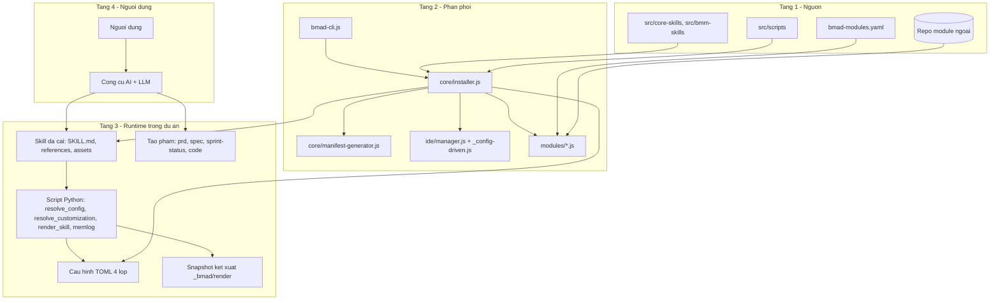

### 2.2 Ranh giới trách nhiệm

| Ranh giới | Bên trái | Bên phải | Hợp đồng |
| --- | --- | --- | --- |
| Installer ↔ Dự án | Node.js | Hệ thống file | `_bmad/` + thư mục skill IDE + manifest |
| Skill ↔ Script | Markdown (LLM đọc) | Python | Lệnh `uv run ...` + JSON/stdout |
| Script ↔ Cấu hình | Python | TOML | `load_central_config`, `load_customization` |
| Renderer ↔ Snapshot | Python | Hệ thống file | `manifest.json` + hash SHA-256 |
| LLM ↔ Workflow | Suy luận | Markdown | Token thay thế + `[[bmad-snapshot:...]]` |

### 2.3 Vì sao LLM là bộ thực thi

Thiết kế cố ý đặt **logic nghiệp vụ trong văn xuôi có cấu trúc**, không phải trong mã. Lý do:

1. Nghiệp vụ ở đây là *phán đoán* (phạm vi này có đa mục tiêu không? kiến trúc này có phân kỳ không?) — mã không mã hóa được.
2. Văn xuôi cho phép người dùng đọc, hiểu và sửa mà không cần biết lập trình.
3. Cùng một nội dung chạy được trên ~50 công cụ AI khác nhau mà không cần adapter.

Hệ quả: mọi thứ *có thể* tất định thì **phải** đẩy xuống script (nguyên lý P1), vì LLM không đáng tin cho việc hợp nhất TOML hay tính hash.

---

## 3. Cấu trúc mã nguồn

```
BMAD-METHOD-main/
├── src/                          # TẦNG NỘI DUNG
│   ├── core-skills/              # module core — 8 skill + 6 shim
│   │   ├── module.yaml           # định nghĩa module + prompt cấu hình
│   │   ├── module-help.csv       # catalog trợ giúp của module
│   │   ├── bmad-<name>/          # một skill = một thư mục
│   │   │   ├── SKILL.md          # điểm vào (bắt buộc)
│   │   │   ├── customize.toml    # bề mặt tùy biến (tùy chọn)
│   │   │   ├── references/       # file nạp just-in-time
│   │   │   ├── assets/           # template, CSV, HTML
│   │   │   ├── types/            # biến thể (deep-recon)
│   │   │   └── scripts/          # script Python + tests/
│   │   └── v6-shims/             # chuyển tiếp ID cũ
│   ├── bmm-skills/               # module bmm
│   │   ├── module.yaml           # + khai báo roster agent
│   │   ├── agents/               # 5 persona
│   │   ├── plan/                 # skill pha 1–3
│   │   ├── ship/                 # skill pha 4
│   │   └── v6-shims/             # 13 shim
│   └── scripts/                  # TẦNG RUNTIME dùng chung
│       ├── config_utils.py       # nạp TOML + hợp nhất cấu trúc
│       ├── resolve_config.py     # CLI 4 lớp
│       ├── resolve_customization.py  # CLI 3 lớp
│       ├── render_skill.py       # bộ máy kết xuất
│       ├── memlog.py             # nhật ký chỉ-nối-thêm
│       └── tests/                # unit test (KHÔNG cài vào dự án)
├── tools/                        # TẦNG PHÂN PHỐI + công cụ dev
│   ├── installer/
│   │   ├── bmad-cli.js           # điểm vào commander
│   │   ├── commands/             # install / status / uninstall
│   │   ├── core/                 # installer, manifest-generator, paths, config
│   │   ├── ide/                  # manager + _config-driven + platform-codes
│   │   ├── modules/              # channel, version, external, custom, plugin
│   │   ├── ui.js                 # luồng prompt (~86 KB)
│   │   ├── prompts.js            # bọc @clack/prompts
│   │   └── set-overrides.js      # bản vá TOML hậu cài đặt
│   ├── validate-skills.js        # 13 quy tắc tất định
│   ├── skill-validator.md        # 26 quy tắc (tất định + suy luận)
│   ├── validate-file-refs.js     # kiểm tra tham chiếu
│   ├── validate-doc-links.js     # kiểm tra liên kết tài liệu
│   ├── validate-sidebar-order.js # kiểm tra thứ tự sidebar
│   └── build-docs.mjs            # dựng website
├── test/                         # test cấp hệ thống (Node)
├── docs/                         # nguồn tài liệu (5 ngôn ngữ)
├── website/                      # Astro + Starlight
├── web-bundles/                  # gói cho Gemini Gems / Custom GPTs
├── bmad-modules.yaml             # REGISTRY module chính thức
├── .claude-plugin/marketplace.json  # đăng ký plugin Claude Code
└── package.json                  # v6.10.0, scripts, deps
```

### 3.1 Bảng phụ thuộc runtime

| Gói | Vai trò |
| --- | --- |
| `commander` | Phân tích lệnh CLI |
| `@clack/core`, `@clack/prompts` | Prompt tương tác |
| `chalk`, `picocolors` | Màu terminal |
| `js-yaml`, `yaml` | Đọc/ghi YAML (module.yaml, manifest.yaml, platform-codes) |
| `csv-parse` | Đọc `module-help.csv`, `files-manifest.csv` |
| `glob`, `ignore` | Duyệt file, tôn trọng `.gitignore` |
| `semver` | So sánh phiên bản, phân loại patch/minor/major |
| `xml2js` | Phân tích cấu hình XML của một số IDE |
| `@kayvan/markdown-tree-parser` | Phân tích cây markdown |

---

## 4. Thiết kế tầng phân phối (Installer)

### 4.1 Sơ đồ lớp

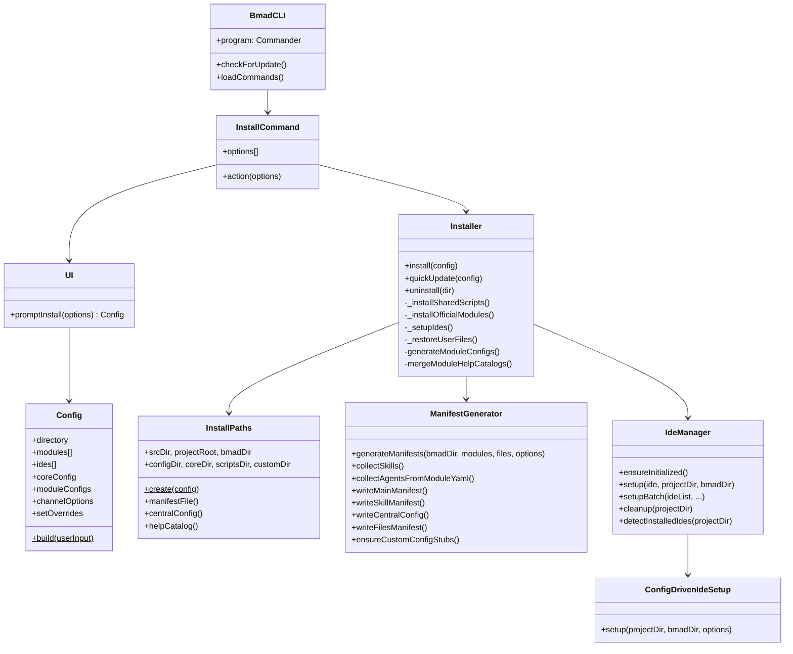

### 4.2 Trình tự cài đặt

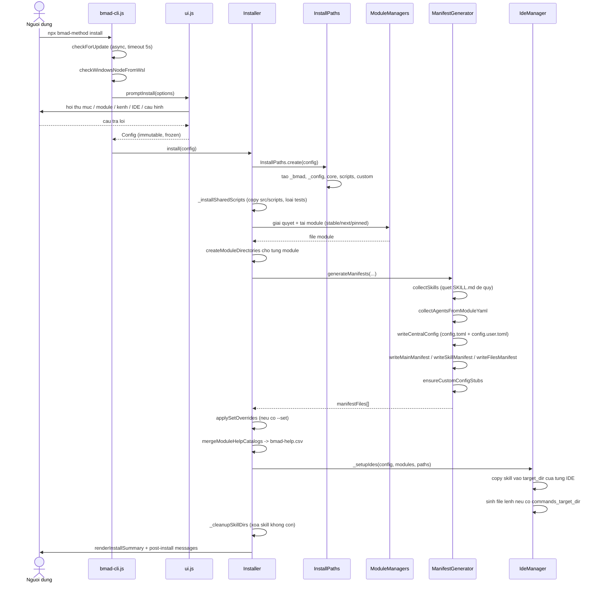

### 4.3 Chiến lược bảo toàn dữ liệu người dùng khi cập nhật

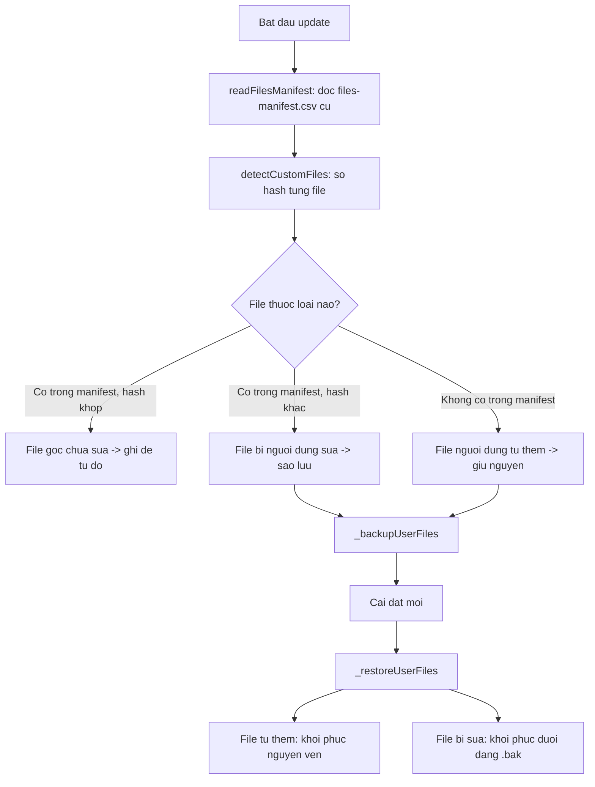

`_bmad/custom/**` **không bao giờ** nằm trong `files-manifest.csv`, nên installer không có lý do chạm vào — đây là bảo đảm cấu trúc, không phải quy ước.

### 4.4 Thiết kế `set-overrides.js`

Cố ý **tách rời** khỏi luồng prompt/template/schema. Lý do và đánh đổi:

| Khía cạnh | Quyết định | Hệ quả |
| --- | --- | --- |
| Thời điểm | Bản vá **sau** khi `writeCentralConfig` chạy xong | Hoạt động giống hệt nhau cho install, update, quick-update |
| Định tuyến | Tìm khóa trong `config.user.toml` trước; thấy thì vá ở đó, không thì vá `config.toml` | Khóa user-scope tự về đúng file |
| Giá trị | Ghi **nguyên văn**, không render template `result:` | Muốn `{project-root}/research` thì phải truyền đầy đủ |
| Bền vững | Khóa có khai báo trong `module.yaml` được ghi thêm vào `_bmad/<mod>/config.yaml` | Sống sót qua lần cài kế tiếp |
| Khóa không khai báo | Chỉ tồn tại ở lần cài hiện tại | Phải truyền `--set` lại, hoặc sửa tay `config.toml` |
| Kiểm tra | **Không** validate `single-select`, không từ chối khóa lạ | Người dùng chịu trách nhiệm |

---

## 5. Thiết kế tầng nội dung (Skill/Agent/Workflow)

### 5.1 Ba khuôn mẫu skill

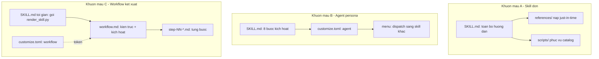

| Khuôn mẫu | Nhận biết | Ví dụ |
| --- | --- | --- |
| **A — Skill đơn** | `SKILL.md` chứa toàn bộ hướng dẫn; có thể có `customize.toml` với `[workflow]` | `bmad-help`, `bmad-review`, `bmad-brainstorming`, `bmad-customize` |
| **B — Agent persona** | `customize.toml` có mục `[agent]`; chỉ 2 file | `bmad-agent-dev`, `bmad-agent-pm`, … |
| **C — Workflow kết xuất** | `SKILL.md` chỉ ~10 dòng gọi `render_skill.py`; có `workflow.md` | `bmad-build`, `bmad-build-auto` |

### 5.2 Giao thức kích hoạt agent (8 bước)

Trích từ `src/bmm-skills/agents/bmad-agent-dev/SKILL.md` — mọi persona đều theo cùng khung này:

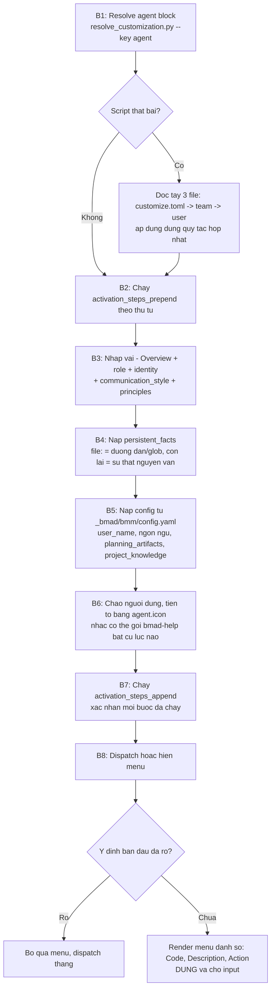

Điểm thiết kế đáng chú ý:

- **Bước 1 có fallback đầy đủ**: nếu script chết, SKILL.md mô tả *chính xác* quy tắc hợp nhất để LLM tự làm. Đây là biểu hiện của P7.
- **Bước 8 tránh nghi thức xác nhận**: nếu ý định đã rõ thì dispatch thẳng; chỉ hỏi khi ≥ 2 mục thực sự gần nhau, và chỉ hỏi *một* câu.
- **Persona bám dính**: khi user gọi skill khác, persona vẫn hoạt động, không "vỡ vai".

### 5.3 Kiến trúc file-bước (Step-File Architecture)

Áp dụng cho khuôn mẫu C. Năm đặc tính:

| Đặc tính | Cơ chế |
| --- | --- |
| **Micro-file Design** | Mỗi bước tự chứa, tuân theo đúng nguyên văn |
| **Just-In-Time Loading** | Chỉ nạp file bước hiện tại |
| **Sequential Enforcement** | Hoàn tất theo thứ tự, không nhảy cóc |
| **State Tracking** | Trạng thái nằm ở frontmatter spec + biến trong bộ nhớ |
| **Append-Only Building** | Tạo phẩm dựng dần, không viết lại |

`bmad-build` có 5 bước chính + 3 file phụ trợ:

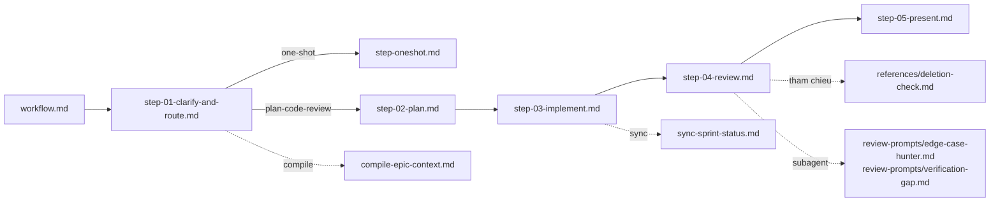

### 5.4 Định tuyến của `step-01-clarify-and-route.md`

Đây là bộ định tuyến trung tâm của toàn bộ pha 4:

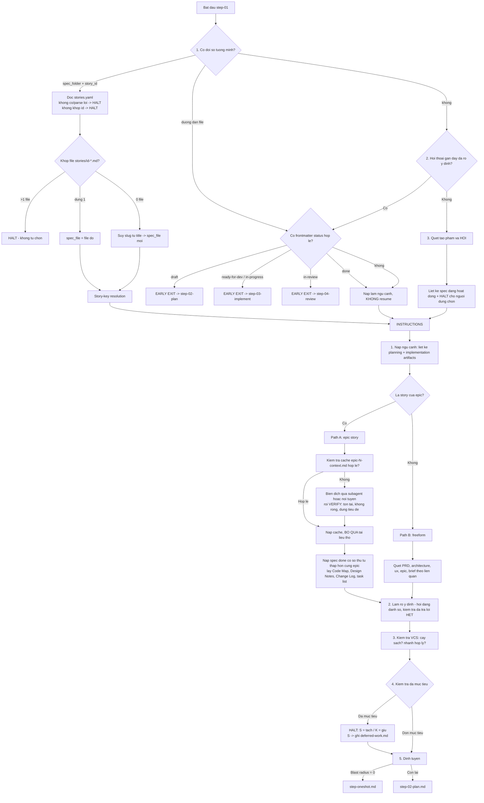

Nguyên tắc quan trọng: **khi không chắc blast radius có thực sự bằng 0 hay không, luôn chọn đường plan-code-review**.

### 5.5 Kiến trúc lens của `bmad-review`

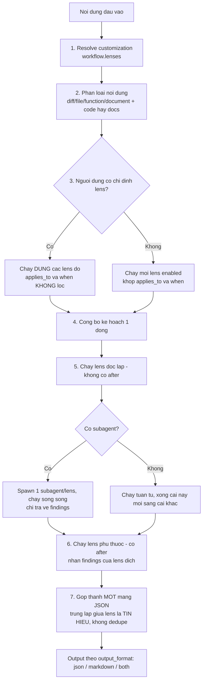

Thiết kế lens là **dữ liệu, không phải mã**: mỗi lens là một mục `[[workflow.lenses]]` với `code`, `name`, `applies_to`, `when`, `instruction`, `after`. Người dùng thêm lens mới bằng cách thêm bảng vào override TOML — không cần đụng đến `SKILL.md`.

Trường `instruction` rỗng ⇒ lens bị tắt. Đây là cách tắt một lens shipped mà không cần cơ chế "disable" riêng.

### 5.6 Kiến trúc shim (v6-shims)

```
_bmad/core/v6-shims/bmad-editorial-review/SKILL.md   (6 dòng)
        │
        └──> chuyển tiếp sang bmad-review với customization đã phân giải sẵn
```

Đặc điểm thiết kế:

- Shim mang **hợp đồng đầu ra riêng**: skill đích phải tôn trọng nó (ví dụ "trả về JSON thô, không có gì khác").
- Shim có thể truyền **customization đã phân giải trước** — skill đích dùng nguyên văn cho các trường được nêu tên, chỉ tự phân giải phần còn lại.
- 19 shim: 6 trong `core` (editorial-review ×3, review-adversarial-general, review-edge-case-hunter, review-verification-gap), 13 trong `bmm`.

---

## 6. Thiết kế tầng runtime (Script Python)

### 6.1 Phân lớp

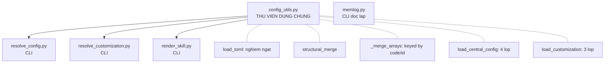

`memlog.py` **cố ý không** phụ thuộc `config_utils` — nó chỉ cần Python ≥ 3.8, không cần `tomllib`, để chạy được ở môi trường tối thiểu nhất.

### 6.2 Thuật toán hợp nhất cấu trúc

```python
def structural_merge(base, override):
    # 1. Hai table  -> deep merge đệ quy
    if isinstance(base, dict) and isinstance(override, dict):
        result = dict(base)
        for key, value in override.items():
            result[key] = structural_merge(result[key], value) if key in result else value
        return result
    # 2. Hai mảng   -> _merge_arrays
    if isinstance(base, list) and isinstance(override, list):
        return _merge_arrays(base, override)
    # 3. Còn lại    -> override thắng
    return override
```

`_merge_arrays` phát hiện **khóa hợp nhất** theo thứ tự `("code", "id")`:

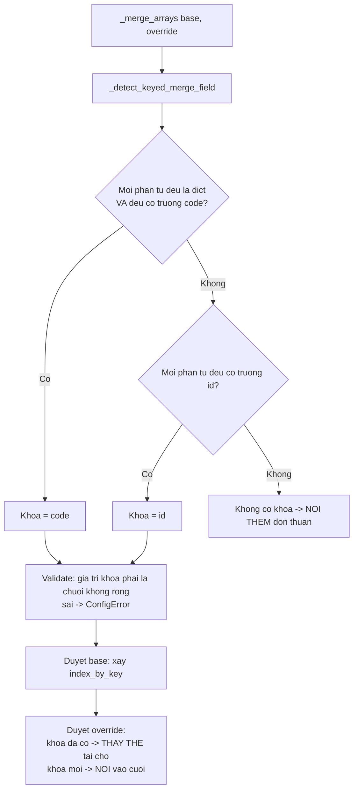

Đây là điểm tinh tế nhất của hệ thống cấu hình: nó cho phép người dùng **thay một mục menu cụ thể** hoặc **thay một lens cụ thể** mà không phải chép lại toàn bộ mảng.

### 6.3 Bảng hành vi hợp nhất

| Loại dữ liệu | Ví dụ trường | Hành vi | Ý nghĩa thực tế |
| --- | --- | --- | --- |
| Scalar chuỗi | `icon`, `role`, `style_guide`, `on_complete` | Lớp sau thắng | Đổi icon, đổi style guide |
| Scalar chuỗi rỗng | `instruction = ""` | Lớp sau thắng (thành rỗng) | **Tắt** một lens |
| Table | `[agent]`, `[workflow]` | Deep merge | Chỉ ghi trường muốn đổi |
| Mảng chuỗi | `persistent_facts`, `principles`, `activation_steps_*` | Nối thêm | Bổ sung quy tắc tổ chức |
| Mảng bảng có `code` | `[[agent.menu]]`, `[[workflow.lenses]]` | Trùng `code` → thay; mới → nối | Sửa một mục menu, thêm lens |
| Mảng bảng có `id` | `review_layers` | Như trên | |

### 6.4 Thiết kế `memlog.py`

Ba bất biến bảo đảm tính đáng tin:

| # | Bất biến | Thực thi |
| --- | --- | --- |
| 1 | **Chỉ nối thêm, theo thời gian** | Không có subcommand `edit`/`delete`; mục luôn ghi ở cuối |
| 2 | **Chỉ ghi / mù** | Mỗi lệnh nguyên tử, không cần ngữ cảnh, echo trạng thái mới dạng JSON một dòng — bên gọi không đọc lại file giữa phiên |
| 3 | **Không có trạng thái vòng đời** | "Xong/blocked/tạm dừng" cũng là *sự kiện đã xảy ra* nên ghi thành mục log, không phải trường frontmatter |

Ghi nguyên tử: `temp file → write → flush → fsync → os.rename` đè lên đích. Sự cố nguồn điện không bao giờ để lại mục ghi dở.

Lần **duy nhất** file được đọc là khi resume — và bên gọi tự đọc, không qua script.

---

## 7. Thiết kế hệ thống cấu hình

### 7.1 Hai trục cấu hình

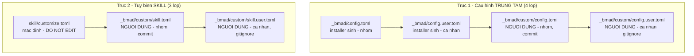

### 7.2 Vì sao 4 lớp mà không phải 2

| Lớp | Ai sở hữu | Vòng đời | Vấn đề nó giải quyết |
| --- | --- | --- | --- |
| `config.toml` | Installer | Ghi đè mỗi lần cài | Nguồn sự thật về *câu trả lời cài đặt* cấp nhóm |
| `config.user.toml` | Installer | Ghi đè mỗi lần cài | Tách câu trả lời cá nhân (tên, ngôn ngữ, trình độ) khỏi cấu hình chung |
| `custom/config.toml` | Người dùng | Vĩnh viễn | Ghim giá trị *bất kể* câu trả lời cài đặt; thêm agent tổ chức |
| `custom/config.user.toml` | Người dùng | Vĩnh viễn | Sở thích cá nhân không muốn commit |

Hệ quả kiến trúc: **installer có thể tái sinh 2 lớp đầu bất cứ lúc nào mà không phá gì**. Đây là thứ cho phép `quick-update` chạy an toàn không cần hỏi lại.

### 7.3 Phân vùng theo scope

`writeCentralConfig` áp dụng thuật toán phân vùng:

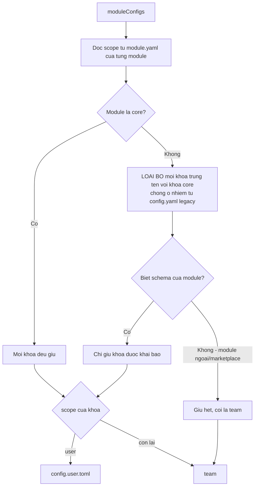

Xử lý đặc biệt cho khối `[agents.*]`: khi một module được **bảo toàn** (ví dụ trong `quickUpdate` mà nguồn không sẵn), `module.yaml` của nó không được đọc ⇒ agent của nó không có trong `this.agents` ⇒ sẽ *biến mất* khỏi roster. Giải pháp: đọc `config.toml` cũ, trích các khối `[agents.<code>]` thuộc module bảo toàn và ghi lại nguyên văn.

### 7.4 Cấu trúc `customize.toml` chuẩn

```toml
# DO NOT EDIT -- overwritten on every update.
#
# Override files (not edited here):
#   {project-root}/_bmad/custom/<skill>.toml         (team)
#   {project-root}/_bmad/custom/<skill>.user.toml    (personal)

[workflow]                      # hoặc [agent] cho persona

activation_steps_prepend = []   # chạy TRƯỚC luồng kích hoạt
activation_steps_append  = []   # chạy SAU luồng kích hoạt

persistent_facts = [            # ngữ cảnh giữ suốt phiên
  "file:{project-root}/**/project-context.md",
]

on_complete = ""                # chỉ thị chạy sau khi xong
output_format = "both"          # json | markdown | both
report_path = ""                # rỗng = chỉ hiện trong chat

[[workflow.lenses]]             # mảng bảng — hợp nhất theo `code`
code = "adversarial"
name = "Adversarial"
applies_to = "any"              # code | docs | any
when = "always"
instruction = "Load `references/lens-adversarial.md` from the skill root and follow it."
```

Ba tiền tố có ngữ nghĩa đặc biệt trong giá trị chuỗi:

| Tiền tố | Ý nghĩa | Dùng ở |
| --- | --- | --- |
| `file:` | Đường dẫn hoặc glob — nạp **nội dung** file làm sự thật/chỉ thị | `persistent_facts`, `review_guidance`, `style_guide` |
| `skill:` | Một skill cần tham vấn | `persistent_facts` của `bmad-party-mode` |
| *(không có)* | Câu chữ nguyên văn | Mọi nơi |

---

## 8. Thiết kế bộ máy kết xuất (Render Engine)

### 8.1 Vấn đề cần giải

Workflow cần biết những giá trị chỉ tồn tại lúc chạy: đường dẫn tuyệt đối của `planning_artifacts`, ngôn ngữ giao tiếp, danh sách lens sau khi hợp nhất, đường dẫn tuyệt đối của file bước kế tiếp. Ba cách tiếp cận và lý do chọn:

| Cách | Vấn đề |
| --- | --- |
| Để LLM tự thay thế biến | Không đáng tin, dễ ảo giác đường dẫn |
| Thay thế lúc cài | Không phản ánh override thay đổi sau đó |
| **Kết xuất lúc chạy thành snapshot bất biến** ✅ | Đúng lúc, tất định, kiểm chứng được, cache được |

### 8.2 Luồng kết xuất

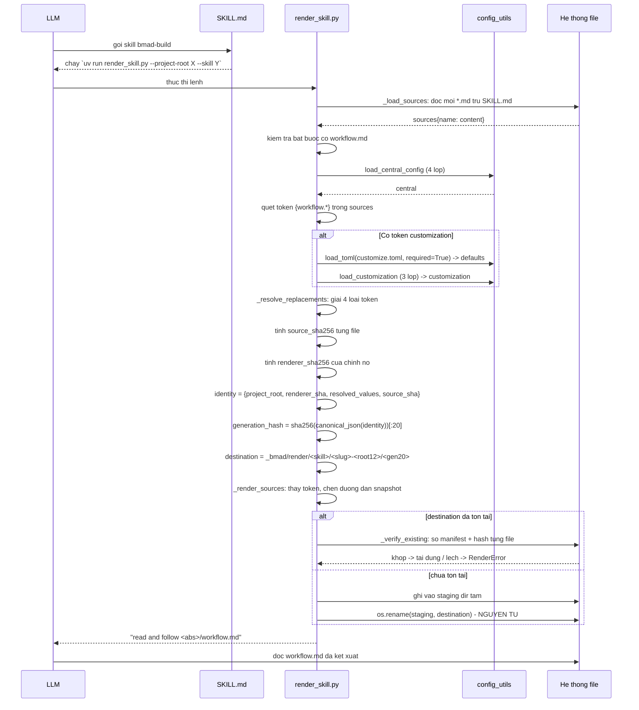

### 8.3 Bốn loại token

| Token | Regex | Nguồn | Ví dụ |
| --- | --- | --- | --- |
| `{{config.<path>}}` | `\{\{config\.([A-Za-z0-9_.-]+)\}\}` | Cấu hình trung tâm, đường dẫn đầy đủ | `{{config.modules.bmm.planning_artifacts}}` |
| `{{.<key>}}` | `\{\{\.([A-Za-z0-9_]+)\}\}` | Tra cứu **ngắn**, tìm đệ quy toàn cây config | `{{.communication_language}}` |
| `{workflow.<field>}` | `\{workflow\.([A-Za-z0-9_.-]+)\}` | `customize.toml` đã hợp nhất | `{workflow.persistent_facts}` |
| `[[bmad-snapshot:<file>.md]]` | `\[\[bmad-snapshot:([A-Za-z0-9_./-]+\.md)\]\]` | Đường dẫn tuyệt đối trong snapshot | `[[bmad-snapshot:step-02-plan.md]]` |

**Quy tắc chống mơ hồ**: `{{.key}}` tìm mọi vị trí trong cây config có tên trùng và **không phải** dict/list. Nếu tìm thấy > 1 ⇒ `RenderError: ambiguous config value 'key' found at: a.b, c.d`. Không đoán.

**Quy tắc chống đệ quy**: `_render_sources` xây **một** regex gộp mọi token rồi thay thế trong *một lượt* duy nhất. Văn bản được chèn vào (đường dẫn, văn xuôi customization) **không bao giờ** được quét lại làm token. Đây là điều ngăn một `persistent_facts` chứa chuỗi `{{.user_name}}` gây thay thế ngoài ý muốn.

### 8.4 Định dạng giá trị khi chèn

`_resolve_customization_value` chọn cách render theo **kiểu của giá trị mặc định**, không phải kiểu của giá trị override:

| Kiểu mặc định | Cách render | Kết quả trong markdown |
| --- | --- | --- |
| `str` | Nguyên văn | Chuỗi |
| `list[str]` | `_format_markdown_list` | `- mục 1`\n`- mục 2`, hoặc `_None._` nếu rỗng |
| `list[dict]` (có `id`) | `_format_review_layers` | Mục `#### Name (id)` + "Run only when: …" + instruction; nếu không có layer active ⇒ chỉ thị HALT |

Nhờ vậy `workflow.md` chỉ cần viết `{workflow.persistent_facts}` và nhận về một danh sách markdown đúng định dạng — kể cả khi rỗng thì cũng có `_None._` để hướng dẫn "bỏ qua".

### 8.5 Định danh generation

```
generation_hash = sha256(canonical_json({
    "project_root":     "<đường dẫn tuyệt đối>",
    "renderer_sha256":  "<hash của chính render_skill.py>",
    "resolved_values":  { "config.core.user_name": "...", "customization.workflow.lenses": [...] },
    "source_sha256":    { "workflow.md": "...", "step-01-...md": "..." }
}))[:20]
```

Bốn thành phần này bao phủ **mọi** thứ có thể làm đầu ra khác đi:

| Thành phần | Bắt được thay đổi nào |
| --- | --- |
| `project_root` | Cùng skill chạy ở dự án khác ⇒ snapshot khác |
| `renderer_sha256` | Nâng cấp BMad làm đổi logic renderer ⇒ kết xuất lại |
| `resolved_values` | Người dùng đổi override hoặc cấu hình ⇒ kết xuất lại |
| `source_sha256` | Nâng cấp module làm đổi nội dung bước ⇒ kết xuất lại |

Ngược lại: **không có gì đổi ⇒ hash không đổi ⇒ `destination.exists()` ⇒ chỉ verify rồi tái dùng**. Đây chính là cơ chế cache, và nó miễn phí.

### 8.6 Đường dẫn snapshot

```
_bmad/render/<skill-name>/<project-slug>-<root-hash-12>/<generation-hash-20>/
                                                        ├── manifest.json
                                                        ├── workflow.md
                                                        ├── step-01-clarify-and-route.md
                                                        └── ...
```

| Đoạn | Cách tính | Vì sao cần |
| --- | --- | --- |
| `<skill-name>` | `skill_dir.name` | Tách theo skill |
| `<project-slug>` | Tên thư mục project, kebab-case, ≤ 80 ký tự, fallback `project` | Đọc được bằng mắt người |
| `<root-hash-12>` | `sha256(str(project_root))[:12]` | Phân biệt hai dự án cùng tên thư mục |
| `<generation-hash-20>` | Như 8.5 | Định danh nội dung |

---

## 9. Thiết kế tích hợp IDE

### 9.1 Kiến trúc hướng cấu hình

Toàn bộ ~50 nền tảng chia sẻ **một** class `ConfigDrivenIdeSetup`. Không có class riêng cho từng IDE. Sự khác biệt được biểu diễn hoàn toàn bằng dữ liệu trong `platform-codes.yaml`:

```yaml
<platform-code>:
  name: "Tên hiển thị"
  preferred: true|false
  suspended: "lý do chặn cài"           # tùy chọn
  installer:
    target_dir: .claude/skills           # thư mục skill trong dự án
    global_target_dir: ~/.claude/skills  # tùy chọn — cài toàn cục
    ancestor_conflict_check: true        # tùy chọn — từ chối nếu thư mục cha có file BMAD
    commands_target_dir: .github/agents   # tùy chọn — sinh file lệnh
    commands_extension: .agent.md         # tùy chọn
    commands_body_template: "LOAD the FULL {project-root}/{target_dir}/{canonicalId}/SKILL.md, ..."
    commands_filter: agents-only          # tùy chọn — chỉ persona
```

Thêm một IDE mới = thêm ~6 dòng YAML. Không sửa mã.

### 9.2 Ba nhóm đích

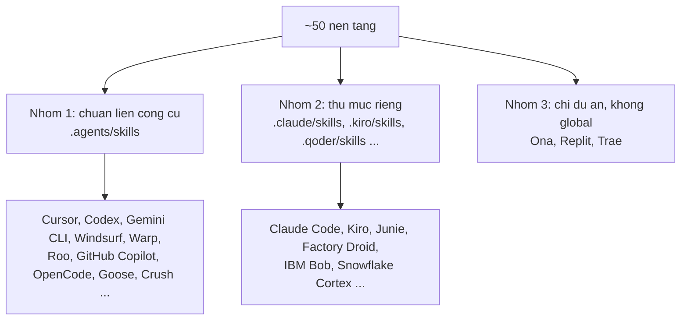

Nhiều nền tảng dùng chung `target_dir` — chuẩn `.agents/skills/` đang trở thành mẫu số chung liên công cụ. Installer viết **một** lần vào thư mục dùng chung là nhiều công cụ cùng thấy.

### 9.3 Lọc `agents-only` — thiết kế đáng chú ý

GitHub Copilot chỉ nên hiện **persona agent** trong bộ chọn Custom Agents, không hiện workflow/tool. Cách phát hiện:

```
Đọc `customize.toml` nguồn của skill → có mục [agent]?
```

Vì sao **không** dùng quy ước đặt tên:

| Trường hợp | Tên | Có `[agent]`? | Đúng/Sai nếu lọc theo tên |
| --- | --- | --- | --- |
| `bmad-tea` | Không chứa `-agent-` | Có | ❌ Lọc theo tên sẽ **bỏ sót** persona |
| `bmad-agent-builder` | Chứa `-agent-` | Không (là `[workflow]`) | ❌ Lọc theo tên sẽ **thêm nhầm** |

Kết luận thiết kế: **tín hiệu cấu hình luôn thắng quy ước đặt tên**.

### 9.4 Sao chép, không symlink

| Phương án | Ưu | Nhược | Quyết định |
| --- | --- | --- | --- |
| Symlink | Cập nhật tự động, tiết kiệm đĩa | Windows cần quyền cao; nhiều IDE không theo symlink; git khó chịu | ❌ |
| **Copy** | Chạy mọi nơi, mọi công cụ; ổn định | Phải cài lại khi cập nhật; tốn đĩa | ✅ |

Kèm theo: **làm sạch đích trước khi copy** để file cũ của phiên bản trước không tồn dư, và `_cleanupSkillDirs` xóa các thư mục skill không còn trong manifest.

---

## 10. Thiết kế phiên bản và kênh phát hành

### 10.1 Hai trục độc lập

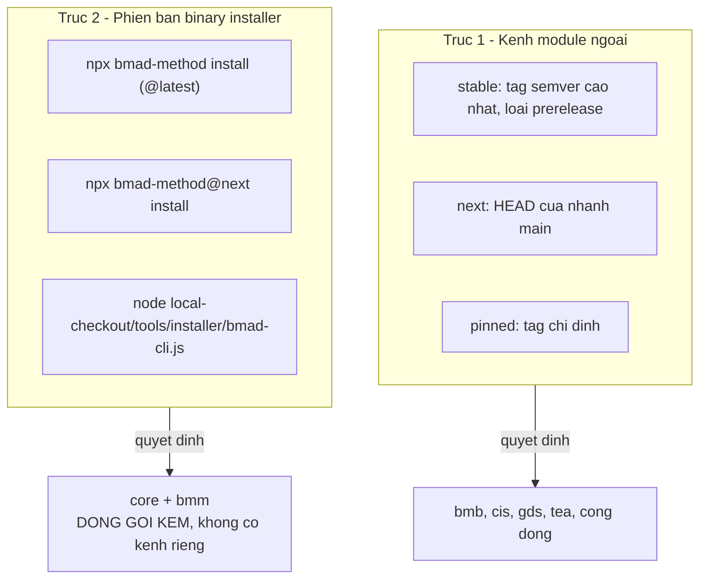

### 10.2 Thuật toán phân giải kênh

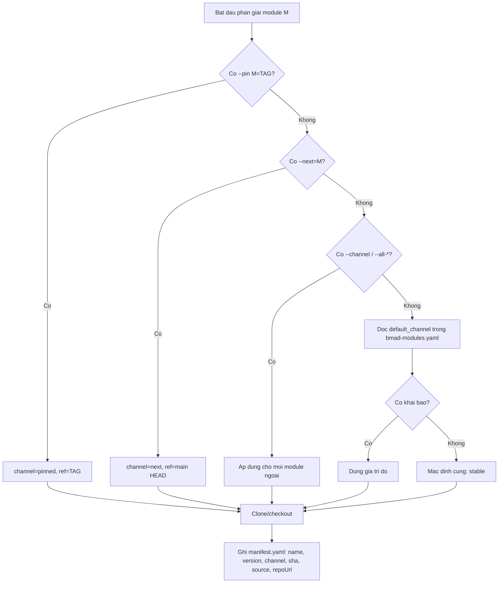

### 10.3 Phân loại nâng cấp

| Loại | Ví dụ | Mặc định tương tác | Dưới `--yes` |
| --- | --- | --- | --- |
| Patch | v1.7.0 → v1.7.1 | Y | Tự áp dụng |
| Minor | v1.7.0 → v1.8.0 | Y | Tự áp dụng |
| Major | v1.7.0 → v2.0.0 | **N** | **Đóng băng** — phải `--pin` mới nhận |

Lý do major mặc định N: *"thay đổi phá vỡ thường xuất hiện dưới dạng 'không ổn định' khi người dùng không lường trước"*. Prompt kèm URL release notes để đọc trước khi đồng ý.

### 10.4 Tái lập cài đặt (reproducibility)

Cài `stable` phân giải tag cao nhất **tại thời điểm cài** ⇒ lặp lại cùng lệnh sau 3 tháng cho kết quả khác. Quy trình tái lập đúng:

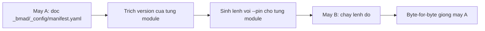

```bash
npx bmad-method install --yes --modules bmb,cis \
  --pin bmb=v1.7.0 --pin cis=v0.4.2 --tools claude-code
```

---

## 11. Thiết kế luồng dữ liệu

### 11.1 Luồng ngữ cảnh qua 4 pha

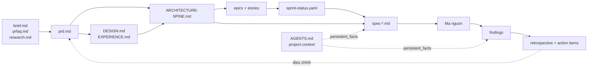

Mỗi tài liệu **trở thành ngữ cảnh cho pha kế tiếp**: PRD nói cho kiến trúc sư biết ràng buộc nào quan trọng; kiến trúc nói cho dev agent biết theo mẫu nào; spec cho ngữ cảnh tập trung và đầy đủ để thực thi.

### 11.2 Cơ chế cache ngữ cảnh epic

Vấn đề: mỗi story trong một epic đều cần cùng bộ ngữ cảnh planning (PRD + architecture + UX + epic file). Nạp lại mỗi lần thì tốn ngữ cảnh khủng khiếp.

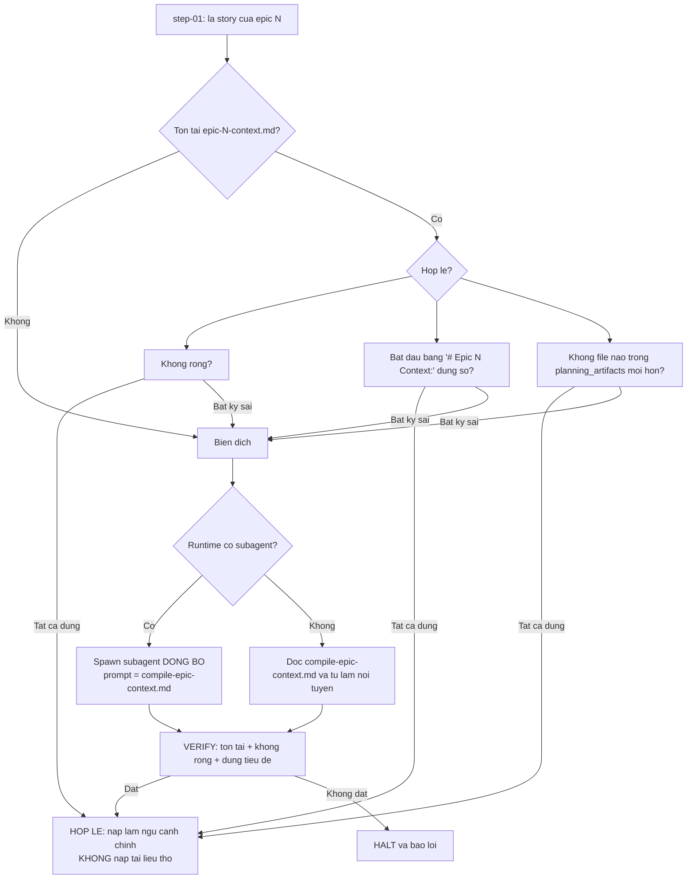

Điều kiện "không file nào trong `planning_artifacts` mới hơn" là một **cache invalidation dựa trên mtime** — đơn giản, không cần hash, đủ chính xác cho mục đích này.

### 11.3 Tính liên tục giữa các story

Sau khi có ngữ cảnh epic, `step-01` quét thêm:

```mermaid
graph LR
  A[Quet implementation_artifacts] --> B[Tim spec cung epic, status=done, story_num thap hon]
  B --> C{Tim thay?}
  C -->|Co| D[Lay spec co story_num CAO NHAT duoi hien tai]
  D --> E[Trich: Code Map, Design Notes,<br/>Spec Change Log, task list]
  E --> F[Dua vao step-02 lam ngu canh lien tuc]
  C -->|Khong| G{Co spec in-review cung epic, story_num thap hon?}
  G -->|Co| H[Bao nguoi dung va HOI co nap khong]
  G -->|Khong| I[Bo qua]
```

Đây là cách hệ thống chuyển **bài học từ story trước** sang story sau mà không cần con người nhắc lại.

### 11.4 Đồng bộ trạng thái sprint

```mermaid
sequenceDiagram
  participant B as bmad-build
  participant SS as sync-sprint-status.md
  participant Y as sprint-status.yaml

  B->>B: step-01 - Story-key resolution
  B->>Y: tim key khop {epic_num}-{story_num}<br/>so sanh SO HOC 2 doan dau
  Note over Y: 1-1 khong bao gio va cham 1-10
  Y-->>B: dung 1 khop -> story_key<br/>0 hoac >1 khop -> bo trong (canh bao neu >1)
  B->>SS: buoc 03 bat dau thuc thi
  SS->>Y: story_key -> in-progress
  SS->>Y: neu la story dau tien: epic-N -> in-progress
  B->>SS: buoc 04 review xong
  SS->>Y: story_key -> review roi -> done
  SS->>Y: cap nhat last_updated
```

---

## 12. Quyết định kiến trúc (ADR)

### ADR-01 — Logic nghiệp vụ nằm trong Markdown, không trong mã

**Bối cảnh:** Cần biểu diễn quy trình phát triển phần mềm cho LLM thực thi.

**Quyết định:** Viết quy trình bằng văn xuôi có cấu trúc trong Markdown; mã chỉ lo phân phối và tính toán tất định.

**Đánh đổi:**

| Được | Mất |
| --- | --- |
| Người dùng đọc/sửa được không cần biết code | Không kiểm tra kiểu tĩnh được |
| Chạy trên mọi công cụ AI không cần adapter | Chất lượng phụ thuộc mô hình |
| Thay đổi quy trình = sửa văn bản | Cần validator riêng (26 quy tắc) để giữ chất lượng |

---

### ADR-02 — Kết xuất snapshot bất biến thay vì thay thế biến lúc chạy

**Bối cảnh:** Workflow cần giá trị chỉ biết lúc chạy.

**Quyết định:** `render_skill.py` sinh snapshot bất biến định danh bằng hash trước khi workflow bắt đầu.

**Hệ quả:**

- LLM chỉ làm việc với **đường dẫn tuyệt đối đã chốt** ⇒ không có cơ hội ảo giác đường dẫn.
- Cache miễn phí: đầu vào không đổi ⇒ hash không đổi ⇒ tái dùng.
- Kiểm chứng được: bất kỳ lúc nào cũng có thể so `manifest.json` với hash thực tế.
- Chi phí: một lần gọi `uv run` ở đầu mỗi workflow; thư mục `render/` phình theo số generation (được gitignore).

---

### ADR-03 — Nhiều lớp TOML thay vì fork nội dung

**Bối cảnh:** Người dùng cần tùy biến; nhóm cần chuẩn hóa; cá nhân cần sở thích riêng.

**Quyết định:** 4 lớp cho cấu hình trung tâm, 3 lớp cho từng skill, với quy tắc hợp nhất cấu trúc rõ ràng.

**Hệ quả:**

- Nâng cấp BMad **không** phá tùy biến (lớp mặc định bị ghi đè, lớp `custom/` không bị chạm).
- Override **thưa**: chỉ ghi trường muốn đổi, không chép cả file.
- Mảng bảng khóa theo `code`/`id` cho phép thay *một mục* trong menu/lens.
- Chi phí: người dùng phải hiểu 3 quy tắc hợp nhất (có `bmad-customize` để khỏi phải tự viết TOML).

---

### ADR-04 — Kiến trúc file-bước với nạp just-in-time

**Bối cảnh:** Workflow phức tạp nếu nạp hết vào ngữ cảnh sẽ đẩy LLM vào "context rot".

**Quyết định:** Mỗi bước một file; chỉ nạp bước hiện tại; cấm nạp nhiều bước cùng lúc.

**Hệ quả:**

- Ngân sách ngữ cảnh giữ ổn định bất kể workflow dài bao nhiêu.
- Bắt buộc trình tự: LLM không thấy bước sau nên không thể "tối ưu" bỏ bước.
- Chi phí: nhiều thao tác đọc file; trạng thái phải được ghi ra ngoài (frontmatter spec) thay vì giữ trong ngữ cảnh.

---

### ADR-05 — Catalog phục vụ qua script, không nạp nguyên khối

**Bối cảnh:** Thư viện phương pháp elicitation và kỹ thuật brainstorming có hàng trăm mục.

**Quyết định:** Script CLI phục vụ theo lát cắt: `categories` (bản đồ rẻ) → `list --category` (chỉ mục nhóm đã chọn) → `show <name>` (chi tiết mục cụ thể) → `random -n 5 --spread` (rút ngẫu nhiên đa dạng).

**Hệ quả:**

- Catalog **không bao giờ** vào ngữ cảnh nguyên khối, trừ đúng một trường hợp: người dùng bấm `[a]` để xem hết.
- Kỹ thuật do người dùng thêm (`additional_methods`) là công dân hạng nhất: truyền `--extra` là nó xuất hiện trong menu, reshuffle, và listing.

---

### ADR-06 — Shim thay vì breaking change

**Bối cảnh:** v6 gộp nhiều skill (6 skill review → 1 `bmad-review`; 3 skill research → `bmad-deep-recon`).

**Quyết định:** Giữ ID cũ dưới dạng skill shim chuyển tiếp, mang theo hợp đồng đầu ra riêng.

**Hệ quả:** Bản cài cũ, tài liệu cũ, thói quen cũ tiếp tục hoạt động. Chi phí: 19 thư mục shim phải bảo trì; mỗi shim phải nêu rõ hợp đồng đầu ra để skill đích tôn trọng.

---

### ADR-07 — Copy skill vào IDE thay vì symlink

Xem [§9.4](#94-sao-chép-không-symlink).

---

### ADR-08 — `--set` là bản vá hậu cài đặt, không tích hợp luồng prompt

**Bối cảnh:** CI cần đặt bất kỳ tùy chọn module nào không tương tác, kể cả module chưa tồn tại khi installer được viết.

**Quyết định:** `--set` chạy **sau** khi installer hoàn tất, vá thẳng vào file TOML.

**Đánh đổi:**

| Được | Mất |
| --- | --- |
| Mở rộng vô hạn cho mọi module hiện tại và tương lai | Không validate `single-select`, không từ chối khóa lạ |
| Hoạt động giống nhau cho install/update/quick-update | Giá trị ghi nguyên văn, không render template `result:` |
| Không phải sửa installer khi module thêm khóa mới | Khóa không khai báo trong `module.yaml` không sống sót lần cài sau |

---

### ADR-09 — Memlog không có trạng thái vòng đời

**Bối cảnh:** Cần biết một phiên đã xong hay chưa khi resume.

**Quyết định:** Không có cờ `complete` trong frontmatter. "Xong" là một *sự kiện đã xảy ra* ⇒ ghi thành mục log.

**Hệ quả:** Chuỗi thời gian là nguồn sự thật **duy nhất**; file không bao giờ phải mutate frontmatter; resume học trạng thái bằng cách đọc các mục cuối — đúng cách nó học mọi thứ khác.

*Lưu ý:* một vài skill (ví dụ `bmad-brainstorming`) vẫn dùng `memlog.py set --key status --value complete` để lật cờ khi wrap-up — đây là trường hợp skill chủ chọn dùng frontmatter cho mục đích riêng của nó, không phải yêu cầu của memlog.

---

## 13. Ma trận truy vết

Ánh xạ yêu cầu → thành phần thiết kế → file mã nguồn.

| Yêu cầu | Thành phần thiết kế | File hiện thực |
| --- | --- | --- |
| FR-INST-01…03 | CLI + Command loader | `tools/installer/bmad-cli.js`, `commands/install.js` |
| FR-INST-04 | Phát hiện bản cài cũ + quickUpdate | `core/existing-install.js`, `core/installer.js:1331` |
| FR-INST-05 | Phân loại nâng cấp | `modules/version-resolver.js` |
| FR-INST-06 | Gỡ cài đặt | `commands/uninstall.js`, `installer.js:1543` |
| FR-INST-08 | Kiểm tra tiền điều kiện | `core/uv-check.js`, `core/wsl-node-check.js` |
| FR-INST-10 | Bảo toàn file người dùng | `installer.js:_backupUserFiles`, `_restoreUserFiles`, `detectCustomFiles` |
| FR-MOD-01…11 | Quản lý module | `bmad-modules.yaml`, `modules/official-modules.js`, `external-manager.js`, `channel-resolver.js`, `plugin-resolver.js`, `custom-module-manager.js` |
| FR-CFG-01…03 | Cấu hình trung tâm 4 lớp | `src/scripts/config_utils.py:load_central_config`, `manifest-generator.js:writeCentralConfig` |
| FR-CFG-04…06 | Tùy biến skill 3 lớp | `config_utils.py:load_customization`, `installer.js:_installSharedScripts` (tạo `.gitignore`) |
| FR-CFG-07…08 | `--set` / `--list-options` | `tools/installer/set-overrides.js`, `list-options.js` |
| FR-SKILL-01…09 | Chuẩn skill | `tools/validate-skills.js`, `tools/skill-validator.md` |
| FR-RENDER-01…10 | Bộ máy kết xuất | `src/scripts/render_skill.py` |
| FR-IDE-01…08 | Tích hợp IDE | `ide/platform-codes.yaml`, `ide/_config-driven.js`, `ide/manager.js` |
| FR-MANIFEST-01…06 | Sinh manifest | `core/manifest-generator.js` |
| FR-MEM-01…06 | Nhật ký phiên | `src/scripts/memlog.py` |
| FR-DOC-01…04 | Tài liệu + bundle | `tools/build-docs.mjs`, `tools/bundle-web-bundles.js`, `website/` |
| NFR-DET-01…05 | Tính tất định | `render_skill.py:_publish`, `_verify_existing`, `memlog.py` |
| NFR-MAINT-03…04 | Validator | `tools/validate-skills.js`, `validate-file-refs.js` |
| Quy tắc 10.1–10.4 | Chuẩn build | `src/bmm-skills/ship/bmad-build/workflow.md`, `step-01-clarify-and-route.md` |
| Quy tắc 10.5 | Epistemics research | `src/core-skills/bmad-deep-recon/SKILL.md` |
| Quy tắc 10.6 | Bộ nhớ phiên | `src/core-skills/bmad-brainstorming/SKILL.md`, `src/scripts/memlog.py` |

---

**Tiếp theo:** [03 — Vận hành hệ thống](./03-van-hanh-he-thong.md) · Quay lại [01 — Đặc tả](./01-dac-ta-he-thong.md)
