# 03 — Vận hành hệ thống (System Operations)

> Hướng dẫn vận hành **BMAD-METHOD v6.10.0**: cài đặt, cấu hình, sử dụng hằng ngày, bảo trì, phát hành, khắc phục sự cố.
> Quay lại [mục lục](./README.md) · [01 — Đặc tả](./01-dac-ta-he-thong.md) · [02 — Thiết kế](./02-thiet-ke-he-thong.md)

---

## Mục lục

1. [Chuẩn bị môi trường](#1-chuẩn-bị-môi-trường)
2. [Cài đặt](#2-cài-đặt)
3. [Cấu hình sau cài đặt](#3-cấu-hình-sau-cài-đặt)
4. [Vận hành hằng ngày](#4-vận-hành-hằng-ngày)
5. [Tùy biến hệ thống](#5-tùy-biến-hệ-thống)
6. [Cập nhật và nâng cấp](#6-cập-nhật-và-nâng-cấp)
7. [Gỡ cài đặt](#7-gỡ-cài-đặt)
8. [Vận hành cho nhóm và doanh nghiệp](#8-vận-hành-cho-nhóm-và-doanh-nghiệp)
9. [Vận hành cho người phát triển BMad](#9-vận-hành-cho-người-phát-triển-bmad)
10. [Giám sát và kiểm tra sức khỏe](#10-giám-sát-và-kiểm-tra-sức-khỏe)
11. [Khắc phục sự cố](#11-khắc-phục-sự-cố)
12. [Sổ tay lệnh nhanh](#12-sổ-tay-lệnh-nhanh)

---

## 1. Chuẩn bị môi trường

### 1.1 Yêu cầu bắt buộc

| Thành phần | Phiên bản | Kiểm tra | Vì sao cần |
| --- | --- | --- | --- |
| Node.js | ≥ 20.12.0 | `node --version` | Chạy installer |
| npm | đi kèm Node | `npm --version` | Tải gói `bmad-method` |
| Python | ≥ 3.10 (thực tế cần 3.11 cho `tomllib`) | `python --version` | Script runtime |
| uv | mới nhất | `uv --version` | Trình chạy script Python |
| Git | bất kỳ | `git --version` | Clone module ngoài |
| Công cụ AI | — | — | Claude Code, Cursor, Codex, Copilot… |

### 1.2 Cài đặt `uv`

```bash
# macOS / Linux
curl -LsSf https://astral.sh/uv/install.sh | sh

# Windows (PowerShell)
powershell -c "irm https://astral.sh/uv/install.ps1 | iex"

# Hoặc qua pip
pip install uv
```

Kiểm chứng: `uv --version`. Installer sẽ tự kiểm tra (`core/uv-check.js`) và cảnh báo nếu thiếu.

### 1.3 Lưu ý riêng cho Windows

| Vấn đề | Triệu chứng | Xử lý |
| --- | --- | --- |
| Node của Windows chạy trong WSL | Đường dẫn lẫn lộn, cài sai chỗ | Installer tự phát hiện (`wsl-node-check.js`) và cảnh báo — hãy cài Node *bên trong* WSL |
| stdin không nhận phím | Prompt treo | Installer đã xử lý riêng cho `win32`; nếu vẫn treo, chạy trong Windows Terminal thay vì console cũ |
| Đường dẫn quá dài | Lỗi khi copy skill | Bật long path: `git config --system core.longpaths true` và bật Long Paths trong Group Policy |

---

## 2. Cài đặt

### 2.1 Cài lần đầu — luồng tương tác

```bash
cd /đường/dẫn/tới/dự-án
npx bmad-method install
```

Luồng hỏi 5 nhóm câu:

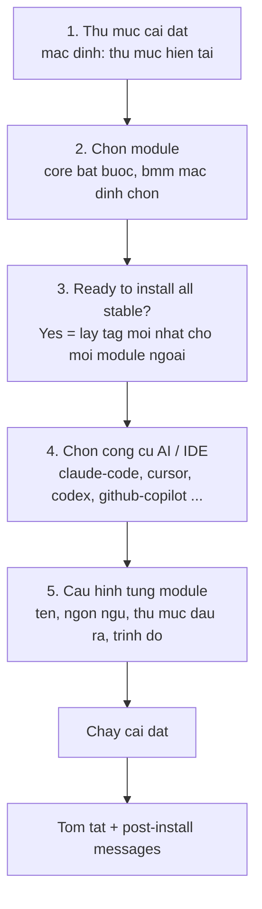

Nhận mặc định toàn bộ ⇒ bạn có bản `stable` mới nhất của mọi module, đã cấu hình cho công cụ đã chọn.

### 2.2 Cài bản tiền phát hành

```bash
npx bmad-method@next install
```

Chạy installer prerelease — kèm bản `core` và `bmm` mới hơn. Nhiều biến động hơn, nhưng độ trễ giữa phát triển và phát hành ngắn hơn.

### 2.3 Cài không tương tác (CI/Docker)

```bash
npx bmad-method install --yes \
  --modules bmm,bmb,cis \
  --tools claude-code \
  --set core.user_name="Đội Backend" \
  --set core.communication_language="Vietnamese" \
  --set core.document_output_language="Vietnamese" \
  --set bmm.user_skill_level=expert
```

> **Bắt buộc:** cài mới với `--yes` **phải** có `--tools`. Xem danh sách hợp lệ: `npx bmad-method install --list-tools`.

### 2.4 Các công thức cài đặt thường dùng

| Mục đích | Lệnh |
| --- | --- |
| Mặc định, mọi thứ bản stable | `npx bmad-method install --yes --modules bmm,bmb,cis --tools claude-code` |
| Ghim phiên bản, tái lập byte-for-byte | `npx bmad-method install --yes --modules bmm,bmb,cis --pin bmb=v1.7.0 --pin cis=v0.2.0 --tools claude-code` |
| Bản mới nhất từ nhánh main | `npx bmad-method install --yes --modules bmm,bmb --all-next --tools claude-code` |
| Thêm module vào bản cài sẵn | `npx bmad-method install --yes --action update --modules bmm,bmb,gds` |
| Trộn kênh: bmb dùng next, còn lại stable | `npx bmad-method install --yes --action update --modules bmm,bmb,cis,gds --next=bmb` |
| Module riêng của tổ chức | `npx bmad-method install --custom-source https://git.cty.vn/ai/bmad-module-internal` |

> Ở công thức "thêm module", `--tools` được **cố ý bỏ qua** — `--action update` tái dùng danh sách công cụ đã cấu hình lần đầu.

### 2.5 Kiểm chứng sau cài đặt

```bash
# 1. Trạng thái tổng quan
npx bmad-method status

# 2. Manifest — module nào, phiên bản nào
cat _bmad/_config/manifest.yaml

# 3. Skill đã cài
cat _bmad/_config/skill-manifest.csv

# 4. Catalog trợ giúp
head -5 _bmad/_config/bmad-help.csv

# 5. Cấu hình hợp nhất (4 lớp)
uv run _bmad/scripts/resolve_config.py --project-root "$(pwd)"

# 6. Skill đã vào thư mục IDE chưa
ls .claude/skills/    # hoặc .agents/skills/
```

Checklist đạt:

- [ ] `_bmad/` tồn tại với đủ `config.toml`, `_config/`, `core/`, `bmm/`, `scripts/`, `custom/`, `render/`
- [ ] `manifest.yaml` liệt kê đúng module đã chọn
- [ ] `skill-manifest.csv` có ≥ 14 dòng (core) + ≥ 30 dòng (bmm)
- [ ] Thư mục skill của IDE chứa các thư mục `bmad-*`
- [ ] `resolve_config.py` trả JSON không lỗi
- [ ] `_bmad/custom/.gitignore` chứa `*.user.toml`

---

## 3. Cấu hình sau cài đặt

### 3.1 Bản đồ file cấu hình

| File | Ai sở hữu | Commit? | Sửa tay? |
| --- | --- | --- | --- |
| `_bmad/config.toml` | Installer | Có | ❌ Bị ghi đè mỗi lần cài |
| `_bmad/config.user.toml` | Installer | Không nên | ❌ Bị ghi đè mỗi lần cài |
| `_bmad/custom/config.toml` | **Bạn** | ✅ Có | ✅ Được |
| `_bmad/custom/config.user.toml` | **Bạn** | ❌ Gitignore | ✅ Được |
| `_bmad/custom/<skill>.toml` | **Bạn** | ✅ Có | ✅ Được |
| `_bmad/custom/<skill>.user.toml` | **Bạn** | ❌ Gitignore | ✅ Được |
| `<skill>/customize.toml` | Module | — | ❌ `DO NOT EDIT` |

**Quy tắc vàng:** muốn đổi bền vững ⇒ ghi vào `_bmad/custom/`. Muốn đổi câu trả lời cài đặt ⇒ chạy lại installer (câu trả lời cũ được nhớ làm mặc định).

### 3.2 Cấu hình tiếng Việt cho toàn bộ hệ thống

```bash
npx bmad-method install --yes --action quick-update \
  --set core.communication_language=Vietnamese \
  --set core.document_output_language=Vietnamese
```

Hoặc ghim vĩnh viễn bất kể câu trả lời cài đặt — tạo `_bmad/custom/config.toml`:

```toml
[core]
document_output_language = "Vietnamese"
project_name = "Hệ thống Quản lý Kho"
```

Và `_bmad/custom/config.user.toml` (không commit):

```toml
[core]
user_name = "Thảo"
communication_language = "Vietnamese"

[modules.bmm]
user_skill_level = "expert"
```

### 3.3 Đổi vị trí thư mục tạo phẩm

```toml
# _bmad/custom/config.toml
[core]
output_folder = "{project-root}/tai-lieu-ai"

[modules.bmm]
planning_artifacts       = "{project-root}/tai-lieu-ai/ke-hoach"
implementation_artifacts = "{project-root}/tai-lieu-ai/thuc-thi"
project_knowledge        = "{project-root}/docs"
```

> Giá trị `--set` được ghi **nguyên văn**. Muốn dạng đã render thì phải truyền đầy đủ: `--set bmm.project_knowledge='{project-root}/research'`.

### 3.4 Thêm agent riêng vào roster

```toml
# _bmad/custom/config.toml
[agents.bmad-agent-security]
module = "custom"
team = "software-development"
name = "Linh"
title = "Security Engineer"
icon = "🔐"
description = "Rà soát mọi thay đổi qua lăng kính OWASP Top 10 và mô hình mối đe dọa STRIDE. Nói ngắn, luôn kèm CVE hoặc tiêu chuẩn tham chiếu."
```

Roster này được `bmad-party-mode`, `bmad-advanced-elicitation` và `bmad-help` đọc để định tuyến và nhập vai.

---

## 4. Vận hành hằng ngày

### 4.1 Hai cách gọi hệ thống

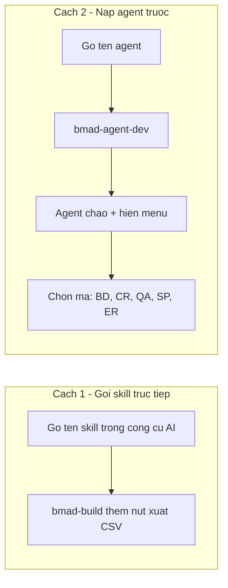

Khuyến nghị: **mỗi workflow chạy trong một cửa sổ ngữ cảnh mới**.

### 4.2 Khi không biết làm gì tiếp

```
bmad-help
```

`bmad-help` sẽ:

1. Đọc `_bmad/_config/bmad-help.csv` — catalog mọi skill của mọi module đã cài.
2. Chạy `resolve_config.py` để biết `output-location` thật.
3. Quét file khớp mẫu `outputs` tại các đường dẫn đó ⇒ suy ra bước nào đã xong.
4. Đọc `project_knowledge` để có ngữ cảnh dự án.
5. Trình bày: **mục tùy chọn trước, mục bắt buộc kế tiếp sau**, kèm mã menu, tên skill, và args nếu có.
6. Nếu chỉ có một bước rõ ràng ⇒ **đề nghị chạy luôn** thay vì chỉ liệt kê.

Ví dụ câu hỏi tự nhiên: `bmad-help tôi có ý tưởng SaaS, bắt đầu từ đâu?`

### 4.3 Kịch bản A — Dự án mới, thay đổi nhỏ (đi thẳng Build)

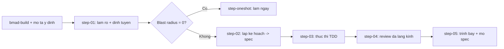

Lệnh:

```
bmad-build thêm nút xuất CSV vào trang danh sách đơn hàng
```

### 4.4 Kịch bản B — Dự án lớn, đi đủ 4 pha

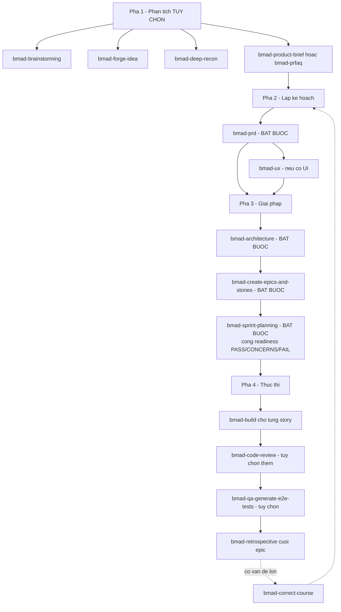

Lệnh tuần tự:

```
bmad-product-brief          # tùy chọn
bmad-prd                    # bắt buộc
bmad-ux                     # nếu UI là phần chính
bmad-architecture           # bắt buộc
bmad-create-epics-and-stories
bmad-sprint-planning
bmad-project-context        # khuyến nghị: gieo AGENTS.md từ kiến trúc
bmad-build                  # lặp cho từng story
bmad-retrospective          # cuối epic
```

### 4.5 Kịch bản C — Dự án đã có mã (brownfield)

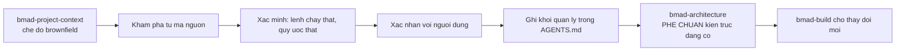

Điểm khác biệt: `bmad-architecture` ở chế độ brownfield **phê chuẩn (ratify)** kiến trúc đang tồn tại thay vì thiết kế mới.

### 4.6 Theo dõi tiến độ sprint

```
bmad-sprint-planning         # tạo/cập nhật sprint plan
```

hoặc gọi action `status` (mã menu `SS`) để xem:

- Tóm tắt trạng thái sprint
- Rủi ro
- Action item còn mở
- Hành động khuyến nghị tiếp theo
- Có thể validate hoặc sửa chữa file tracking

Xem/sửa trực tiếp:

```bash
cat _bmad-output/implementation-artifacts/sprint-status.yaml

# validate bằng script
uv run .claude/skills/bmad-sprint-planning/scripts/sprint_plan.py validate \
  --status-file _bmad-output/implementation-artifacts/sprint-status.yaml

# xem trạng thái (đánh dấu story "ôi" quá N ngày)
uv run .claude/skills/bmad-sprint-planning/scripts/sprint_plan.py status \
  --status-file _bmad-output/implementation-artifacts/sprint-status.yaml \
  --stale-days 7
```

### 4.7 Review trước khi ship

```
bmad-review                      # tự chọn lens phù hợp nội dung
bmad-review lenses=adversarial   # chỉ định lens cụ thể
bmad-review <đường/dẫn/file.md>  # review một file
```

| Nội dung đưa vào | Lens tự chạy |
| --- | --- |
| Diff / branch / thay đổi chưa commit | `adversarial`, `edge-case-hunter`, `verification-gap` |
| PRD / spec / story / plan | `adversarial`, `edge-case-hunter`, `structure`, `prose` |
| Văn bản thuần | `adversarial`, `structure`, `prose` |

> Khi bạn **chỉ định** lens, `applies_to` và `when` không lọc nữa — lens được yêu cầu luôn chạy.

### 4.8 Bảng lệnh theo tình huống

| Tình huống | Skill |
| --- | --- |
| Không biết làm gì tiếp | `bmad-help` |
| Cần ý tưởng | `bmad-brainstorming` |
| Muốn thử thách một ý tưởng đến khi nó chắc chắn hoặc chết | `bmad-forge-idea` |
| Cần bằng chứng cho một quyết định | `bmad-deep-recon` |
| Muốn nhiều góc nhìn cùng lúc | `bmad-party-mode` |
| Bản nháp vừa ra còn nông | `bmad-advanced-elicitation` |
| Chốt WHAT trước khi làm HOW | `bmad-spec` |
| Xây/sửa/kiểm tra PRD | `bmad-prd` |
| Ra quyết định kỹ thuật | `bmad-architecture` |
| Chia việc thành story | `bmad-create-epics-and-stories` |
| Kiểm tra sẵn sàng thực thi | `bmad-sprint-planning` |
| Viết mã | `bmad-build` |
| Kiểm tra chất lượng | `bmad-review` / `bmad-code-review` |
| Sinh test E2E | `bmad-qa-generate-e2e-tests` |
| Người duyệt cần đi qua thay đổi | `bmad-checkpoint-preview` |
| Kế hoạch trật đường ray | `bmad-correct-course` |
| Kết thúc epic | `bmad-retrospective` |
| Đổi hành vi agent/workflow | `bmad-customize` |
| Thiết lập ngữ cảnh repo cho AI | `bmad-project-context` |

---

## 5. Tùy biến hệ thống

### 5.1 Cách dễ nhất — dùng chính BMad

```
bmad-customize
```

Skill này tự: quét skill nào tùy biến được → chọn đúng phạm vi (agent hay workflow) → soạn TOML → hiện diff và chờ bạn duyệt → ghi vào `_bmad/custom/` → chạy resolver để **xác minh** override đã ăn.

Ví dụ câu lệnh tự nhiên:

```
bmad-customize làm cho Amelia luôn viết comment tiếng Việt
bmad-customize thêm một lens review về hiệu năng
bmad-customize đổi thư mục lưu spec sang docs/specs
```

### 5.2 Sáu bề mặt tùy biến

| Bề mặt | Trường | Hành vi hợp nhất | Ví dụ dùng |
| --- | --- | --- | --- |
| Bước kích hoạt | `activation_steps_prepend` / `_append` | Nối thêm | Kiểm tra tuân thủ trước khi bắt đầu |
| Sự thật bền vững | `persistent_facts` | Nối thêm | "Tổ chức chỉ dùng AWS — đừng đề xuất GCP" |
| Nguyên tắc | `principles` (agent) | Nối thêm | Chuẩn code nội bộ |
| Menu | `[[agent.menu]]` khóa `code` | Trùng `code` thay, mới thì nối | Bỏ/đổi/thêm mục menu |
| Lens | `[[workflow.lenses]]` khóa `code` | Như trên | Thêm lens accessibility |
| Scalar | `icon`, `role`, `style_guide`, `on_complete`, `report_path`, `output_format` | Lớp sau thắng | Đổi style guide |

### 5.3 Ví dụ đầy đủ — override cấp nhóm

`_bmad/custom/bmad-review.toml` (commit vào repo):

```toml
[workflow]

# Sự thật đứng sau mọi lần review
persistent_facts = [
  "file:{project-root}/docs/coding-standards.md",
]

# Chỉ thị áp cho mọi lens
review_guidance = [
  "Mọi API công khai phải có ví dụ sử dụng trong docstring.",
  "file:{project-root}/docs/thuat-ngu.md",
]

# Style guide cho hai lens biên tập
style_guide = "file:{project-root}/docs/style-guide-vi.md"
reader_type = "humans"

# Ghi báo cáo ra file thay vì chỉ hiện trong chat
report_path = "{project-root}/_bmad-output/reviews"
output_format = "both"

# Thêm một lens mới — code chưa tồn tại nên được NỐI THÊM
[[workflow.lenses]]
code = "accessibility"
name = "Khả năng tiếp cận"
applies_to = "any"
when = "Mã UI hoặc tài liệu hướng tới người dùng cuối."
instruction = "Rà soát theo WCAG 2.2 AA. Xuất finding theo đúng các trường chuẩn."

# Tắt lens prose — code đã tồn tại nên THAY THẾ mục cũ
[[workflow.lenses]]
code = "prose"
name = "Editorial Prose"
applies_to = "docs"
instruction = ""      # rỗng = tắt
```

### 5.4 Xác minh override

```bash
uv run _bmad/scripts/resolve_customization.py \
  --skill .claude/skills/bmad-review \
  --project-root "$(pwd)" \
  --key workflow
```

Đọc JSON trả về và kiểm tra đúng trường bạn đã đổi. Nếu chưa ăn, ba nguyên nhân thường gặp: sai tên trường, sai chế độ hợp nhất (scalar vs mảng), sai phạm vi (team vs user).

### 5.5 Team scope hay user scope?

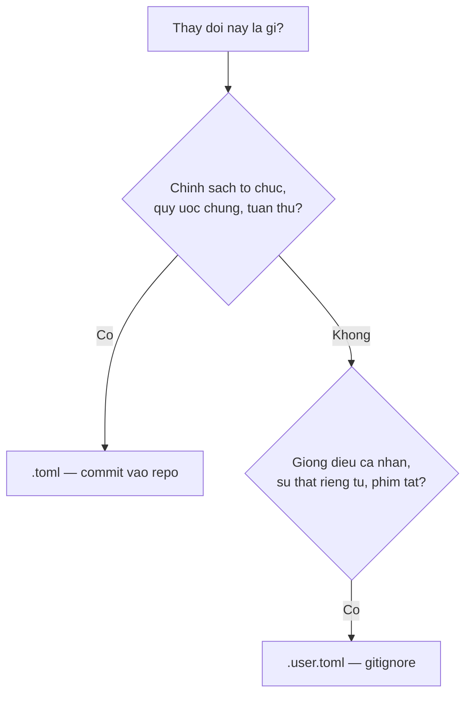

---

## 6. Cập nhật và nâng cấp

### 6.1 Hai chế độ

```bash
npx bmad-method install     # trong thư mục đã có _bmad/
```

| Lựa chọn | Làm gì | Khi nào dùng |
| --- | --- | --- |
| **Quick Update** | Chạy lại cài đặt với thiết lập cũ. Làm mới file, áp patch và minor stable, **từ chối** major. Nhanh, không tương tác. | Cập nhật định kỳ |
| **Modify Install** | Luồng tương tác đầy đủ. Thêm/bớt module, đổi cấu hình, xem lại và đổi kênh. | Đổi cấu trúc cài đặt |

### 6.2 Điều được bảo toàn khi cập nhật

| Bảo toàn ✅ | Bị ghi đè ❌ |
| --- | --- |
| `_bmad/custom/**` (mọi override) | `_bmad/config.toml`, `config.user.toml` |
| File bạn tự thêm vào `_bmad/` | `_bmad/core/**`, `_bmad/bmm/**` |
| File bạn sửa (lưu thành `.bak`) | `_bmad/scripts/**` |
| `_bmad-output/**` (tạo phẩm) | `_bmad/_config/**` |
| `docs/`, mã nguồn dự án | Skill trong thư mục IDE |

### 6.3 Quy trình cập nhật an toàn

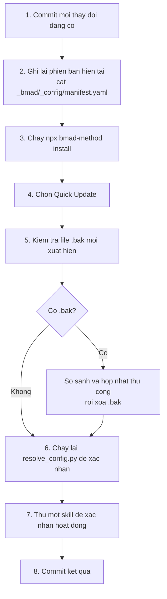

### 6.4 Đổi kênh của một module

**Tương tác:** chọn Modify → trả lời **Yes** cho "Review channel assignments?" → mỗi module ngoài cho chọn: Keep / Switch to stable / Switch to next / Pin to a tag.

**Bằng cờ:**

```bash
# Đưa bmb về nhánh main
npx bmad-method install --yes --action update --modules bmm,bmb --next=bmb

# Ghim cis vào tag cụ thể
npx bmad-method install --yes --action update --modules bmm,cis --pin cis=v0.4.2

# Đưa mọi module ngoài về stable
npx bmad-method install --yes --action update --modules bmm,bmb,cis --all-stable
```

### 6.5 Xử lý nâng cấp major

Nâng cấp major mặc định **N**. Quy trình đúng:

1. Đọc release notes tại URL mà prompt hiển thị.
2. Cân nhắc thay đổi phá vỡ với override bạn đang có.
3. Chấp nhận có chủ đích:

```bash
npx bmad-method install --yes --action update --modules bmm,bmb --pin bmb=v2.0.0
```

4. Kiểm chứng override còn phân giải đúng: `resolve_customization.py` cho từng skill bạn đã tùy biến.

---

## 7. Gỡ cài đặt

```bash
npx bmad-method uninstall
```

### 7.1 Ba thành phần chọn gỡ

| Thành phần | Nội dung | Mặc định chọn |
| --- | --- | --- |
| **BMAD Modules & data** (`_bmad/`) | Bản cài, agent, workflow, cấu hình | ✅ |
| **IDE integrations** | Thư mục skill trong `.claude/skills`, `.agents/skills`… | ✅ |
| **User artifacts** (`_bmad-output/`) | ⚠️ **Sản phẩm công việc của bạn** | ❌ |

### 7.2 Trình tự thực hiện


Pha 3 chạy cuối vì hai pha trước còn cần đọc `_bmad/` để biết gỡ cái gì.

### 7.3 Cảnh báo

Lệnh gỡ hiển thị cảnh báo đỏ và yêu cầu xác nhận rõ ràng (mặc định **No**):

```
💀 This action is IRREVERSIBLE! Removed files cannot be recovered!
💀 IDE configurations and modules will need to be reinstalled.
💀 User artifacts are preserved unless explicitly selected.
```

Chế độ `--yes` gỡ mọi thành phần **nhưng vẫn bảo toàn tạo phẩm người dùng**.

Cài lại: `npx bmad-method install`.

---

## 8. Vận hành cho nhóm và doanh nghiệp

### 8.1 Chiến lược version control

```gitignore
# .gitignore của dự án

# BMad — nội dung do installer sinh, tái tạo được
_bmad/core/
_bmad/bmm/
_bmad/scripts/
_bmad/_config/
_bmad/render/
_bmad/config.user.toml

# Lớp override cá nhân
_bmad/custom/*.user.toml

# Thư mục skill của IDE (tái tạo bằng lệnh cài)
.claude/skills/bmad-*
.agents/skills/bmad-*
```

**Nên commit:**

| File | Vì sao |
| --- | --- |
| `_bmad/config.toml` | Ghi lại câu trả lời cài đặt cấp nhóm |
| `_bmad/custom/config.toml` | Chuẩn của tổ chức |
| `_bmad/custom/<skill>.toml` | Tùy biến cấp nhóm |
| `_bmad/_config/manifest.yaml` | Ghi lại phiên bản chính xác để tái lập |
| `_bmad-output/**` | Tạo phẩm là tài sản của dự án |
| `AGENTS.md` | Ngữ cảnh dự án cho mọi AI |

### 8.2 Chuẩn hóa cho cả nhóm

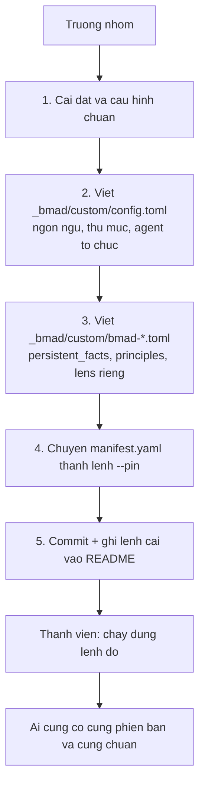

Lệnh chuẩn viết vào `README.md` của dự án:

```bash
npx bmad-method install --yes \
  --modules bmm,bmb \
  --pin bmb=v1.7.0 \
  --tools claude-code,cursor
```

### 8.3 Tái lập môi trường giữa các máy

```bash
# Máy A — trích phiên bản đang chạy
grep -A2 "name:" _bmad/_config/manifest.yaml

# Máy B — cài đúng phiên bản đó
npx bmad-method install --yes --modules bmb,cis \
  --pin bmb=v1.7.0 --pin cis=v0.4.2 --tools claude-code
```

> **Không** dựa vào việc lặp lại cùng lệnh `--modules`. Kênh `stable` phân giải tag cao nhất **tại thời điểm cài**.

### 8.4 Giới hạn API GitHub trên IP dùng chung

Văn phòng sau NAT, pool CI runner, VPN dùng chung IP ⇒ dễ cạn 60 lượt/giờ.

```bash
export GITHUB_TOKEN=<personal access token>
npx bmad-method install ...
```

PAT chỉ cần quyền đọc public repo, không cần scope nào ⇒ nâng lên 5000 lượt/giờ/tài khoản.

### 8.5 Cài trong Dockerfile

```dockerfile
FROM node:20-slim

RUN apt-get update && apt-get install -y git curl \
 && curl -LsSf https://astral.sh/uv/install.sh | sh
ENV PATH="/root/.local/bin:${PATH}"

WORKDIR /app
COPY . .

ARG GITHUB_TOKEN
RUN npx bmad-method install --yes \
      --modules bmm,bmb \
      --pin bmb=v1.7.0 \
      --tools claude-code \
      --set core.communication_language=Vietnamese
```

---

## 9. Vận hành cho người phát triển BMad

### 9.1 Thiết lập môi trường dev

```bash
git clone https://github.com/bmad-code-org/BMAD-METHOD.git
cd BMAD-METHOD
npm ci                 # ci, không phải install — dùng đúng lockfile
```

`npm ci` chạy hook `prepare` để cài husky (chỉ khi husky có sẵn).

### 9.2 Vòng lặp phát triển

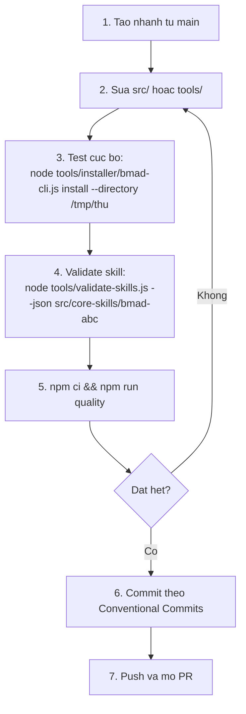

### 9.3 Cổng chất lượng — 13 bước

```bash
npm run quality
```

| # | Bước | Lệnh | Bắt gì |
| --- | --- | --- | --- |
| 1 | Format | `format:check` | Prettier lệch |
| 2 | Lint JS | `lint` | ESLint, cảnh báo cũng fail |
| 3 | Lint MD | `lint:md` | markdownlint |
| 4 | Docs | `docs:build` | Liên kết hỏng (chạy validate bên trong) |
| 5 | Site URL | `test:site-url` | URL site sai |
| 6 | Install | `test:install` | Thành phần cài đặt hỏng |
| 7 | URLs | `test:urls` | Parse URL nguồn |
| 8 | Renderer | `test:renderer` | `test_config_utils`, `test_resolve_config`, `test_resolve_customization`, `test-build-auto-renderer` |
| 9 | Retrospective | `test:retrospective` | `test_git_evidence`, `test_sprint_status` |
| 10 | Sprint planning | `test:sprint-planning` | `test_sprint_plan`, `test-template-sync` |
| 11 | File refs | `validate:refs --strict` | Tham chiếu file hỏng |
| 12 | Skills | `validate:skills --strict` | 13 quy tắc tất định |
| 13 | Sidebar | `docs:validate-sidebar` | Thứ tự sidebar sai |

Chạy riêng lẻ khi cần:

```bash
npm run lint:fix              # tự sửa ESLint
npm run format:fix            # tự sửa Prettier
npm run docs:fix-links        # tự sửa liên kết tài liệu
node tools/validate-skills.js --json src/bmm-skills/ship/bmad-build
```

### 9.4 Thêm một skill mới

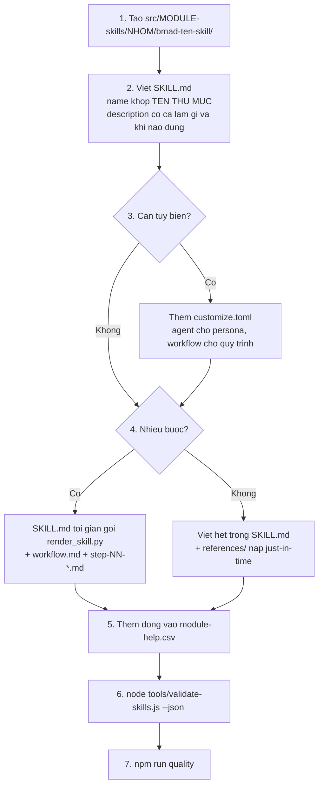

Checklist bắt buộc:

- [ ] `SKILL.md` có frontmatter `name` + `description`
- [ ] `name` khớp regex `^bmad-[a-z0-9]+(-[a-z0-9]+)*$` và **khớp tên thư mục**
- [ ] `description` ≤ 1024 ký tự, nêu cả *làm gì* và *khi nào dùng*
- [ ] Thân bài không rỗng
- [ ] Tham chiếu nội bộ là đường dẫn tương đối từ file gốc
- [ ] Không trỏ vào thư mục skill khác
- [ ] Không có biến frontmatter trỏ vào file trong cùng skill
- [ ] Script Python (nếu có) kèm test trong `scripts/tests/`
- [ ] Thêm dòng vào `module-help.csv`

### 9.5 Thêm một IDE mới

Chỉ cần thêm vào `tools/installer/ide/platform-codes.yaml`:

```yaml
  ten-cong-cu:
    name: "Tên Hiển Thị"
    preferred: false
    installer:
      target_dir: .tencongcu/skills
      global_target_dir: ~/.tencongcu/skills
```

Không cần sửa mã. Kiểm chứng: `node tools/installer/bmad-cli.js install --list-tools`.

### 9.6 Quy trình phát hành

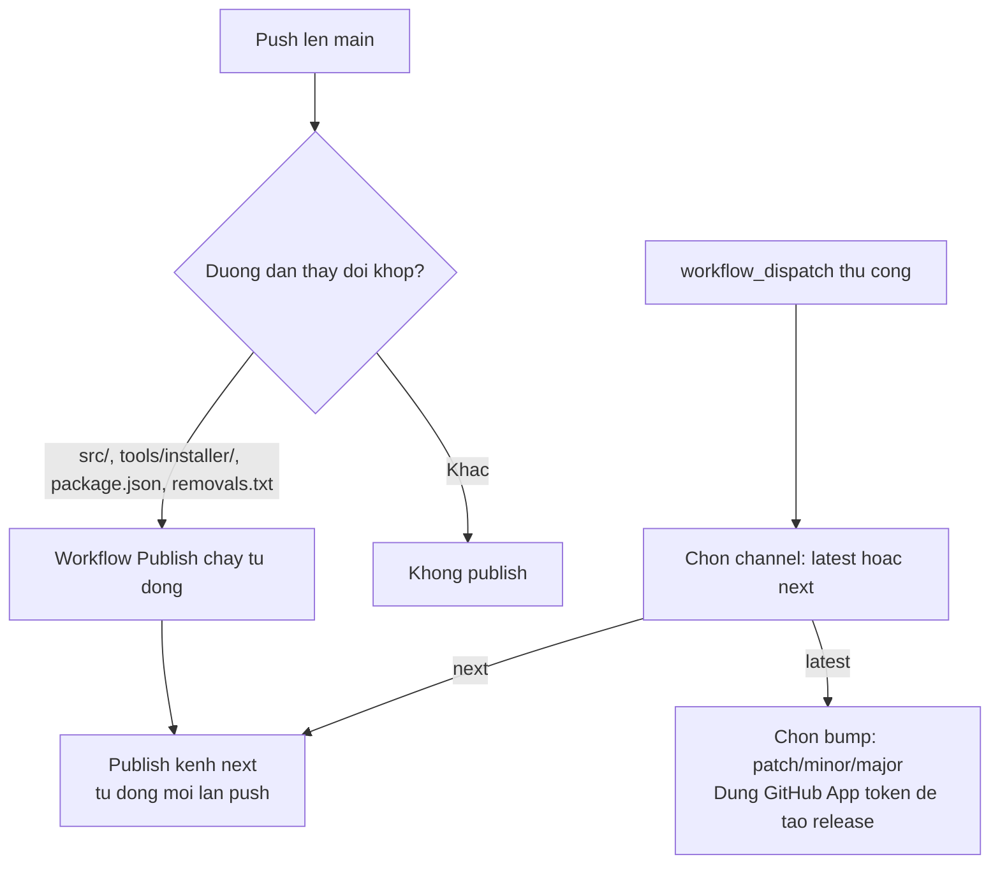

Điều kiện: chỉ chạy trên repo `bmad-code-org/BMAD-METHOD`, và với `workflow_dispatch` thì phải trên `refs/heads/main`.

### 9.7 Workflow CI

| Workflow | Kích hoạt | Việc |
| --- | --- | --- |
| `quality.yaml` | push main, PR mọi nhánh, thủ công | 5 job song song: prettier, eslint, markdownlint, docs, validate |
| `publish.yaml` | push main (đường dẫn khớp), thủ công | Publish npm |
| `docs.yaml` | — | Deploy website tài liệu |
| `coderabbit-review.yaml` | — | Review PR tự động |
| `discord.yaml` | — | Thông báo cộng đồng |

---

## 10. Giám sát và kiểm tra sức khỏe

### 10.1 Script kiểm tra sức khỏe

```bash
#!/usr/bin/env bash
# health-check.sh — kiểm tra bản cài BMad
set -u
ROOT="$(pwd)"
FAIL=0

echo "== 1. Cấu trúc thư mục =="
for d in _bmad _bmad/_config _bmad/scripts _bmad/custom _bmad/render; do
  if [ -d "$ROOT/$d" ]; then echo "  OK   $d"; else echo "  FAIL $d"; FAIL=1; fi
done

echo "== 2. File cấu hình =="
for f in _bmad/config.toml _bmad/_config/manifest.yaml \
         _bmad/_config/skill-manifest.csv _bmad/_config/bmad-help.csv; do
  if [ -f "$ROOT/$f" ]; then echo "  OK   $f"; else echo "  FAIL $f"; FAIL=1; fi
done

echo "== 3. Script runtime =="
for s in resolve_config.py resolve_customization.py render_skill.py memlog.py config_utils.py; do
  if [ -f "$ROOT/_bmad/scripts/$s" ]; then echo "  OK   $s"; else echo "  FAIL $s"; FAIL=1; fi
done

echo "== 4. Phân giải cấu hình =="
if uv run "$ROOT/_bmad/scripts/resolve_config.py" --project-root "$ROOT" > /dev/null 2>&1; then
  echo "  OK   resolve_config chạy được"
else
  echo "  FAIL resolve_config lỗi"; FAIL=1
fi

echo "== 5. Số skill đã cài =="
if [ -f "$ROOT/_bmad/_config/skill-manifest.csv" ]; then
  echo "  $(($(wc -l < "$ROOT/_bmad/_config/skill-manifest.csv") - 1)) skill"
fi

echo "== 6. Gitignore bảo vệ lớp cá nhân =="
if grep -q '\*.user.toml' "$ROOT/_bmad/custom/.gitignore" 2>/dev/null; then
  echo "  OK   custom/.gitignore"
else
  echo "  WARN custom/.gitignore thiếu *.user.toml"
fi

echo "== 7. Tiền điều kiện =="
node --version 2>/dev/null | sed 's/^/  node /' || { echo "  FAIL node"; FAIL=1; }
uv --version 2>/dev/null | sed 's/^/  /'        || { echo "  FAIL uv";   FAIL=1; }
git --version 2>/dev/null | sed 's/^/  /'       || echo "  WARN git"

exit $FAIL
```

### 10.2 Chỉ số theo dõi

| Chỉ số | Cách lấy | Ngưỡng cảnh báo |
| --- | --- | --- |
| Số generation kết xuất | `ls _bmad/render/*/*/ \| wc -l` | > 100 ⇒ nên dọn |
| Dung lượng `_bmad/render` | `du -sh _bmad/render` | > 100 MB ⇒ nên dọn |
| Story "ôi" trong sprint | `sprint_plan.py status --stale-days 7` | Có story quá 7 ngày |
| Action item còn mở | Xem `action_items` trong `sprint-status.yaml` | Tích tụ qua nhiều epic |
| Module lệch phiên bản | `npx bmad-method status` | Có update chưa áp |
| File `.bak` tồn dư | `find _bmad -name "*.bak"` | > 0 ⇒ chưa hợp nhất sau update |

### 10.3 Dọn dẹp snapshot kết xuất

```bash
# An toàn: xóa toàn bộ, sẽ tự kết xuất lại khi cần
rm -rf _bmad/render/*/
# (giữ lại .gitignore)
```

Snapshot là cache thuần túy — xóa không mất dữ liệu, chỉ tốn một lần kết xuất lại.

---

## 11. Khắc phục sự cố

### 11.1 Lỗi cài đặt

| Triệu chứng | Nguyên nhân | Xử lý |
| --- | --- | --- |
| `Could not resolve stable tag` / `API rate limit exceeded` | Cạn 60 lượt/giờ của GitHub ẩn danh | `export GITHUB_TOKEN=<PAT>` rồi thử lại; token cũ có thể đã hết hạn |
| `Tag 'vX.Y.Z' not found` | Tag truyền cho `--pin` không tồn tại | Kiểm tra trang Releases của repo module |
| Bản `--pin` vẫn tự nâng cấp | Đang pin `core`/`bmm` — hai module này đóng gói kèm installer | Dùng đúng phiên bản installer: `npx bmad-method@<version> install` |
| `BMAD source root does not exist` | Chạy CLI từ vị trí sai | Chạy `npx bmad-method install`, không gọi file trực tiếp |
| `permission denied creating directory` | Không có quyền ghi | Đổi thư mục cài hoặc sửa quyền |
| `no space left on device` | Hết đĩa | Dọn đĩa |
| Cài `--yes` báo thiếu tools | Cài mới không tương tác bắt buộc `--tools` | Thêm `--tools claude-code` |
| Prompt treo trên Windows | Console cũ không xử lý stdin | Dùng Windows Terminal / PowerShell 7 |

### 11.2 Lỗi runtime script

| Triệu chứng | Nguyên nhân | Xử lý |
| --- | --- | --- |
| `error: Python 3.11+ is required` (thoát mã 3) | Thiếu `tomllib` | Cài Python ≥ 3.11 hoặc `uv run --python 3.11 ...` |
| `uv: command not found` | Chưa cài uv | Xem [§1.2](#12-cài-đặt-uv) |
| `required TOML file not found: .../config.toml` | Chưa cài BMad, hoặc sai project root | Chạy installer; truyền `--project-root` đúng |
| `failed to parse <file>: ...` | TOML sai cú pháp | Sửa file — thông báo có số dòng |
| `keyed array identifier 'code' must be a string` | `code` trong mảng bảng không phải chuỗi hoặc rỗng | Sửa override |

### 11.3 Lỗi kết xuất

| Triệu chứng | Nguyên nhân | Xử lý |
| --- | --- | --- |
| `HALT: render entry is missing: .../workflow.md` | Skill dạng C thiếu `workflow.md` | Lỗi đóng gói skill — báo issue |
| `HALT: ambiguous config value 'x' found at: a.b, c.d` | Token `{{.x}}` khớp nhiều nhánh config | Đổi sang dạng đầy đủ `{{config.a.b}}` |
| `HALT: missing config value 'x'` | Khóa không tồn tại sau khi hợp nhất | Bổ sung khóa vào `_bmad/custom/config.toml` |
| `HALT: generation collision or corruption at ...` | Thư mục generation bị sửa tay hoặc hỏng | `rm -rf` đúng thư mục generation đó rồi chạy lại |
| `HALT: generation contains unexpected or missing files` | Có file lạ trong snapshot | Như trên |
| `HALT: customization tokens require customize.toml` | Nguồn dùng `{workflow.*}` nhưng skill không có `customize.toml` | Lỗi đóng gói — báo issue |
| `HALT: render source escapes skill directory` | Symlink trỏ ra ngoài skill | Gỡ symlink |

### 11.4 Skill không xuất hiện trong công cụ AI

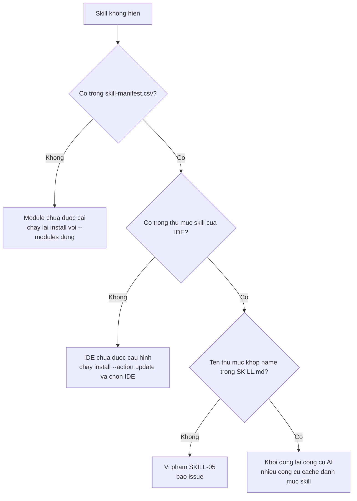

### 11.5 Override không có tác dụng

```mermaid
graph TB
  A[Override khong an] --> B[Chay resolve_customization.py --key workflow]
  B --> C{Gia tri co trong JSON?}
  C -->|Khong| D{Dat dung thu muc _bmad/custom/?}
  D -->|Khong| E[Chuyen file vao dung cho]
  D -->|Co| F{Ten file khop TEN SKILL?}
  F -->|Khong| G["Doi ten thanh <skill-name>.toml"]
  F -->|Co| H{Dung muc [workflow] hay [agent]?}
  H -->|Sai| I[Doc customize.toml goc de biet muc dung]
  C -->|Co, nhung khong doi hanh vi| J{Loai du lieu?}
  J -->|Mang| K[Mang NOI THEM, khong thay the<br/>muon thay -> phai la mang bang co code/id]
  J -->|Scalar| L[Kiem tra lop uu tien:<br/>user.toml thang team.toml]
  J -->|Mang bang| M[Kiem tra code/id co KHOP CHINH XAC khong]
```

### 11.6 Cập nhật làm mất tùy biến

| Kiểm tra | Lệnh |
| --- | --- |
| Override có còn không? | `ls -la _bmad/custom/` |
| Có `.bak` mới không? | `find _bmad -name "*.bak" -newermt "-1 day"` |
| Cấu hình hợp nhất còn đúng? | `uv run _bmad/scripts/resolve_config.py --project-root "$(pwd)"` |

Nếu bạn từng sửa trực tiếp `_bmad/config.toml` (không được khuyến khích): giá trị đó **đã mất** — chuyển sang `_bmad/custom/config.toml` để không bao giờ mất nữa.

### 11.7 Workflow chạy sai bước / bỏ bước

Nguyên nhân thường gặp và cách xử lý:

| Nguyên nhân | Dấu hiệu | Xử lý |
| --- | --- | --- |
| Ngữ cảnh quá tải | LLM "quên" quy tắc, nhảy bước | Bắt đầu cửa sổ ngữ cảnh mới, gọi lại skill |
| Frontmatter spec sai `status` | Định tuyến sai bước | Sửa `status` trong `spec-*.md` |
| Snapshot cũ | Workflow chạy bản cũ | `rm -rf _bmad/render/<skill>/` rồi gọi lại |
| Ý định chứa chỉ thị "bỏ bước" | Workflow rút ngắn | Đây là hành vi *đúng*: workflow phải bỏ qua chỉ thị đó — nếu không, báo issue |

### 11.8 Bật chế độ gỡ lỗi

```bash
# Debug quá trình sinh manifest
npx bmad-method install --debug
# tương đương BMAD_DEBUG_MANIFEST=true

# Debug lệnh status
BMAD_DEBUG=1 npx bmad-method status

# Verbose khi cài
BMAD_VERBOSE_INSTALL=true npx bmad-method install
```

---

## 12. Sổ tay lệnh nhanh

### 12.1 Vòng đời cài đặt

```bash
npx bmad-method install                    # cài / cập nhật (tương tác)
npx bmad-method@next install               # bản tiền phát hành
npx bmad-method status                     # trạng thái + có update không
npx bmad-method uninstall                  # gỡ (tương tác)
npx bmad-method install --list-tools       # liệt kê IDE hỗ trợ
npx bmad-method install --list-options     # liệt kê khóa --set
npx bmad-method install --list-options bmm # ... của riêng module bmm
```

### 12.2 Script runtime

```bash
R="$(pwd)"

# Cấu hình hợp nhất 4 lớp
uv run "$R/_bmad/scripts/resolve_config.py" --project-root "$R"
uv run "$R/_bmad/scripts/resolve_config.py" --project-root "$R" --key core --key agents

# Tùy biến hợp nhất 3 lớp
uv run "$R/_bmad/scripts/resolve_customization.py" \
  --skill "$R/.claude/skills/bmad-review" --project-root "$R" --key workflow

# Kết xuất workflow thủ công
uv run --no-cache "$R/_bmad/scripts/render_skill.py" \
  --project-root "$R" --skill "$R/.claude/skills/bmad-build"

# Memlog
uv run "$R/_bmad/scripts/memlog.py" init   --workspace <dir> --field topic="X" --field goal="Y"
uv run "$R/_bmad/scripts/memlog.py" append --workspace <dir> --type idea --text "..." --by user
uv run "$R/_bmad/scripts/memlog.py" set    --workspace <dir> --key status --value complete
```

### 12.3 Phát triển BMad

```bash
npm ci                          # cài đúng lockfile
npm run quality                 # cổng chất lượng đầy đủ (13 bước)
npm test                        # bộ test đầy đủ
npm run lint:fix                # tự sửa ESLint
npm run format:fix              # tự sửa Prettier
npm run docs:dev                # chạy website tài liệu cục bộ
npm run docs:build              # dựng website
npm run rebundle                # đóng gói lại web bundles
node tools/validate-skills.js --json <đường/dẫn/skill>
node tools/installer/bmad-cli.js install --directory /tmp/thu-nghiem
```

### 12.4 Biến môi trường

| Biến | Giá trị | Tác dụng |
| --- | --- | --- |
| `GITHUB_TOKEN` | PAT | Nâng hạn mức API GitHub lên 5000/giờ |
| `BMAD_DEBUG_MANIFEST` | `true` | Log chi tiết khi sinh manifest |
| `BMAD_DEBUG` | bất kỳ | Hiện stack trace cho `status` |
| `BMAD_VERBOSE_INSTALL` | `true` | Log chi tiết khi cài |

### 12.5 Đường dẫn quan trọng

| Đường dẫn | Nội dung |
| --- | --- |
| `_bmad/_config/manifest.yaml` | Module, phiên bản, kênh, sha |
| `_bmad/_config/skill-manifest.csv` | Danh mục skill đã cài |
| `_bmad/_config/files-manifest.csv` | Hash file để phát hiện sửa đổi |
| `_bmad/_config/bmad-help.csv` | Catalog trợ giúp gộp |
| `_bmad/config.toml` | Cấu hình nhóm (installer sinh) |
| `_bmad/custom/` | **Vùng của bạn** — installer không chạm |
| `_bmad/render/` | Snapshot kết xuất (cache, gitignore) |
| `_bmad-output/planning-artifacts/` | Tạo phẩm pha 1–3 |
| `_bmad-output/implementation-artifacts/` | Tạo phẩm pha 4 |
| `AGENTS.md` | Ngữ cảnh dự án cho AI |

---

**Quay lại:** [Mục lục](./README.md) · [01 — Đặc tả](./01-dac-ta-he-thong.md) · [02 — Thiết kế](./02-thiet-ke-he-thong.md)
