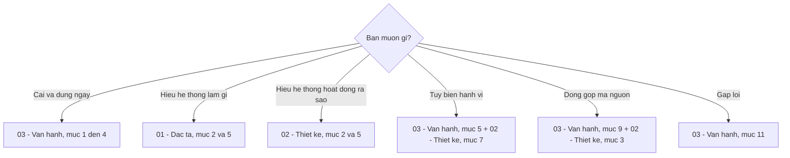

# Tài liệu hệ thống BMAD-METHOD v6

> Bộ tài liệu tiếng Việt mô tả đầy đủ hệ thống **BMAD-METHOD v6.10.0** — đặc tả, thiết kế và vận hành.
> Được xây dựng bằng cách đọc trực tiếp mã nguồn của repo này, không suy đoán.

---

## Bộ tài liệu

| # | Tài liệu | Trả lời câu hỏi | Dành cho |
| --- | --- | --- | --- |
| 01 | **[Đặc tả hệ thống](./01-dac-ta-he-thong.md)** | Hệ thống làm **cái gì**? | Người cần biết phạm vi, chức năng, dữ liệu, ràng buộc |
| 02 | **[Thiết kế hệ thống](./02-thiet-ke-he-thong.md)** | Hệ thống làm **như thế nào**? | Người cần hiểu kiến trúc, thuật toán, quyết định thiết kế |
| 03 | **[Vận hành hệ thống](./03-van-hanh-he-thong.md)** | **Dùng và duy trì** ra sao? | Người cài đặt, cấu hình, sử dụng hằng ngày, khắc phục sự cố |

---

## Bắt đầu từ đâu

| Vai trò của bạn | Đọc theo thứ tự |
| --- | --- |
| **Người dùng mới** | 03 §1–4 → 01 §2 → 03 §12 |
| **Trưởng nhóm / kiến trúc sư** | 01 toàn bộ → 02 §2, §12 → 03 §8 |
| **Người tùy biến hệ thống** | 03 §5 → 02 §7 → 01 §5.3 |
| **Người đóng góp mã BMad** | 02 §3 → 03 §9 → 01 §11 |
| **Người vận hành CI/CD** | 03 §2.3, §8 → 01 §7.1 |

---

## Tra cứu nhanh theo chủ đề

### Kiến trúc và khái niệm

| Chủ đề | Ở đâu |
| --- | --- |
| Ba mặt phẳng của hệ thống | [01 §2.2](./01-dac-ta-he-thong.md#22-ba-mặt-phẳng-của-hệ-thống) |
| Bốn pha của BMM | [01 §2.4](./01-dac-ta-he-thong.md#24-bốn-pha-của-module-bmm) |
| Bảy nguyên lý thiết kế | [02 §1](./02-thiet-ke-he-thong.md#1-nguyên-lý-thiết-kế) |
| Sơ đồ kiến trúc tầng | [02 §2.1](./02-thiet-ke-he-thong.md#21-sơ-đồ-tầng) |
| Vì sao LLM là bộ thực thi | [02 §2.3](./02-thiet-ke-he-thong.md#23-vì-sao-llm-là-bộ-thực-thi) |
| Chín quyết định kiến trúc (ADR) | [02 §12](./02-thiet-ke-he-thong.md#12-quyết-định-kiến-trúc-adr) |
| Thuật ngữ | [01 §12](./01-dac-ta-he-thong.md#12-thuật-ngữ) |

### Skill và Agent

| Chủ đề | Ở đâu |
| --- | --- |
| Danh mục skill `core` (8 skill) | [01 §5.4](./01-dac-ta-he-thong.md#54-nhóm-fr-skill--skill-và-agent) |
| Danh mục skill `bmm` (17 mục) | [01 §5.4](./01-dac-ta-he-thong.md#54-nhóm-fr-skill--skill-và-agent) |
| Năm agent persona | [01 §3.2](./01-dac-ta-he-thong.md#32-vai-trò-agent-nhân-vật-ai--module-bmm) |
| Ba khuôn mẫu skill | [02 §5.1](./02-thiet-ke-he-thong.md#51-ba-khuôn-mẫu-skill) |
| Giao thức kích hoạt agent (8 bước) | [02 §5.2](./02-thiet-ke-he-thong.md#52-giao-thức-kích-hoạt-agent-8-bước) |
| Kiến trúc file-bước | [02 §5.3](./02-thiet-ke-he-thong.md#53-kiến-trúc-file-bước-step-file-architecture) |
| Định tuyến của `bmad-build` | [02 §5.4](./02-thiet-ke-he-thong.md#54-định-tuyến-của-step-01-clarify-and-routemd) |
| Kiến trúc lens của `bmad-review` | [02 §5.5](./02-thiet-ke-he-thong.md#55-kiến-trúc-lens-của-bmad-review) |
| Chuẩn skill (26 quy tắc validator) | [01 §5.4](./01-dac-ta-he-thong.md#54-nhóm-fr-skill--skill-và-agent), [03 §9.4](./03-van-hanh-he-thong.md#94-thêm-một-skill-mới) |

### Cấu hình và tùy biến

| Chủ đề | Ở đâu |
| --- | --- |
| Bốn lớp cấu hình trung tâm | [01 §5.3](./01-dac-ta-he-thong.md#53-nhóm-fr-cfg--cấu-hình), [02 §7.1](./02-thiet-ke-he-thong.md#71-hai-trục-cấu-hình) |
| Ba lớp tùy biến skill | [02 §7.1](./02-thiet-ke-he-thong.md#71-hai-trục-cấu-hình) |
| Thuật toán hợp nhất cấu trúc | [02 §6.2](./02-thiet-ke-he-thong.md#62-thuật-toán-hợp-nhất-cấu-trúc) |
| Bảng hành vi hợp nhất | [02 §6.3](./02-thiet-ke-he-thong.md#63-bảng-hành-vi-hợp-nhất) |
| Sáu bề mặt tùy biến | [03 §5.2](./03-van-hanh-he-thong.md#52-sáu-bề-mặt-tùy-biến) |
| Ví dụ override đầy đủ | [03 §5.3](./03-van-hanh-he-thong.md#53-ví-dụ-đầy-đủ--override-cấp-nhóm) |
| Cấu hình tiếng Việt | [03 §3.2](./03-van-hanh-he-thong.md#32-cấu-hình-tiếng-việt-cho-toàn-bộ-hệ-thống) |
| Thêm agent riêng | [03 §3.4](./03-van-hanh-he-thong.md#34-thêm-agent-riêng-vào-roster) |

### Bộ máy kết xuất

| Chủ đề | Ở đâu |
| --- | --- |
| Yêu cầu kết xuất (FR-RENDER) | [01 §5.5](./01-dac-ta-he-thong.md#55-nhóm-fr-render--kết-xuất-workflow) |
| Luồng kết xuất đầy đủ | [02 §8.2](./02-thiet-ke-he-thong.md#82-luồng-kết-xuất) |
| Bốn loại token | [02 §8.3](./02-thiet-ke-he-thong.md#83-bốn-loại-token) |
| Cách tính `generation_hash` | [02 §8.5](./02-thiet-ke-he-thong.md#85-định-danh-generation) |
| Lỗi kết xuất thường gặp | [03 §11.3](./03-van-hanh-he-thong.md#113-lỗi-kết-xuất) |

### Cài đặt và vận hành

| Chủ đề | Ở đâu |
| --- | --- |
| Yêu cầu môi trường | [03 §1](./03-van-hanh-he-thong.md#1-chuẩn-bị-môi-trường) |
| Công thức cài đặt | [03 §2.4](./03-van-hanh-he-thong.md#24-các-công-thức-cài-đặt-thường-dùng) |
| Toàn bộ cờ CLI | [01 §7.1](./01-dac-ta-he-thong.md#71-giao-diện-dòng-lệnh) |
| Bố cục `_bmad/` | [01 §7.4](./01-dac-ta-he-thong.md#74-giao-diện-file--bố-cục-_bmad-sau-khi-cài) |
| Kênh phiên bản (stable/next/pinned) | [02 §10](./02-thiet-ke-he-thong.md#10-thiết-kế-phiên-bản-và-kênh-phát-hành) |
| Cập nhật an toàn | [03 §6.3](./03-van-hanh-he-thong.md#63-quy-trình-cập-nhật-an-toàn) |
| Vận hành nhóm / doanh nghiệp | [03 §8](./03-van-hanh-he-thong.md#8-vận-hành-cho-nhóm-và-doanh-nghiệp) |
| Script kiểm tra sức khỏe | [03 §10.1](./03-van-hanh-he-thong.md#101-script-kiểm-tra-sức-khỏe) |
| Khắc phục sự cố | [03 §11](./03-van-hanh-he-thong.md#11-khắc-phục-sự-cố) |
| Sổ tay lệnh nhanh | [03 §12](./03-van-hanh-he-thong.md#12-sổ-tay-lệnh-nhanh) |

### Dữ liệu và tạo phẩm

| Chủ đề | Ở đâu |
| --- | --- |
| Bảng tạo phẩm theo pha | [01 §8.1](./01-dac-ta-he-thong.md#81-bảng-tạo-phẩm-theo-pha) |
| Lược đồ `sprint-status.yaml` | [01 §8.2](./01-dac-ta-he-thong.md#82-lược-đồ-sprint-statusyaml) |
| Frontmatter spec | [01 §8.3](./01-dac-ta-he-thong.md#83-lược-đồ-frontmatter-spec-spec-md) |
| Lược đồ `.memlog.md` | [01 §8.4](./01-dac-ta-he-thong.md#84-lược-đồ-memlogmd) |
| Lược đồ finding của review | [01 §8.5](./01-dac-ta-he-thong.md#85-lược-đồ-finding-của-bmad-review) |
| Luồng ngữ cảnh qua 4 pha | [02 §11.1](./02-thiet-ke-he-thong.md#111-luồng-ngữ-cảnh-qua-4-pha) |
| Cache ngữ cảnh epic | [02 §11.2](./02-thiet-ke-he-thong.md#112-cơ-chế-cache-ngữ-cảnh-epic) |

### Quy tắc nghiệp vụ

| Chủ đề | Ở đâu |
| --- | --- |
| Chuẩn "Ready for Development" | [01 §10.1](./01-dac-ta-he-thong.md#101-chuẩn-sẵn-sàng-phát-triển-ready-for-development) |
| Chuẩn phạm vi (Scope Standard) | [01 §10.2](./01-dac-ta-he-thong.md#102-chuẩn-phạm-vi-scope-standard) |
| Quy tắc điều hướng workflow | [01 §10.3](./01-dac-ta-he-thong.md#103-quy-tắc-điều-hướng-workflow) |
| Epistemics của Deep Recon | [01 §10.5](./01-dac-ta-he-thong.md#105-quy-tắc-epistemics-của-bmad-deep-recon) |
| Quy tắc bộ nhớ phiên | [01 §10.6](./01-dac-ta-he-thong.md#106-quy-tắc-bộ-nhớ-phiên) |

---

## Số liệu tổng quan

| Hạng mục | Số lượng |
| --- | --- |
| Phiên bản | 6.10.0 |
| Module chính thức | 7 (2 đóng gói + 5 ngoài) + 2 deprecated |
| Skill module `core` | 8 + 6 shim |
| Skill module `bmm` | 17 mục menu + 13 shim |
| Agent persona | 5 |
| Nền tảng AI hỗ trợ | ~50 |
| Script Python dùng chung | 5 |
| Lens review mặc định | 5 |
| Quy tắc validator skill | 26 (13 tất định + 13 suy luận) |
| Bước trong cổng chất lượng | 13 |
| Web bundle | 6 |
| Ngôn ngữ tài liệu gốc | 5 (en, cs, fr, vi-vn, zh-cn) |

---

## Bộ tài liệu liên quan trong repo này

| Thư mục | Nội dung |
| --- | --- |
| `tai-lieu-he-thong/` | **Bộ này** — đặc tả, thiết kế, vận hành |
| `docs/` | Tài liệu gốc của dự án (tiếng Anh + 4 ngôn ngữ) |
| `docs/vi-vn/` | Bản dịch tiếng Việt của tài liệu gốc |
| `AGENTS.md` | Quy tắc dành cho AI khi làm việc trên repo này |
| `CONTRIBUTING.md` | Hướng dẫn đóng góp |
| `tools/skill-validator.md` | 26 quy tắc kiểm tra skill |

---

*Tài liệu này mô tả BMAD-METHOD phiên bản 6.10.0. Khi nâng cấp lên phiên bản mới, đối chiếu lại các mục có tham chiếu số dòng mã nguồn.*
